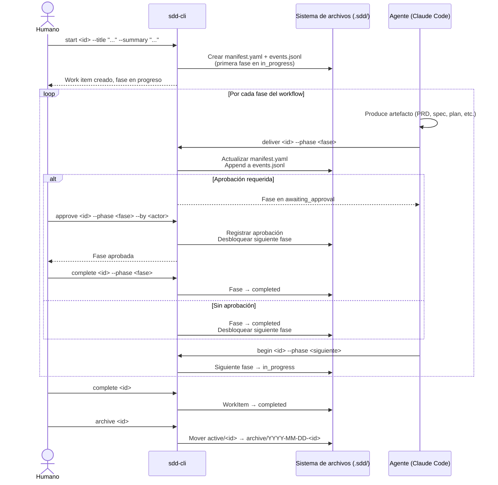
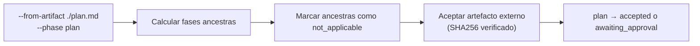
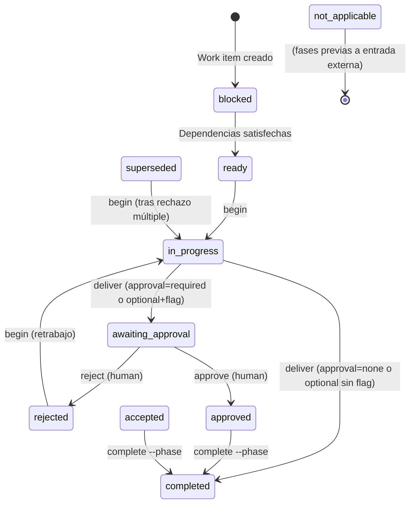
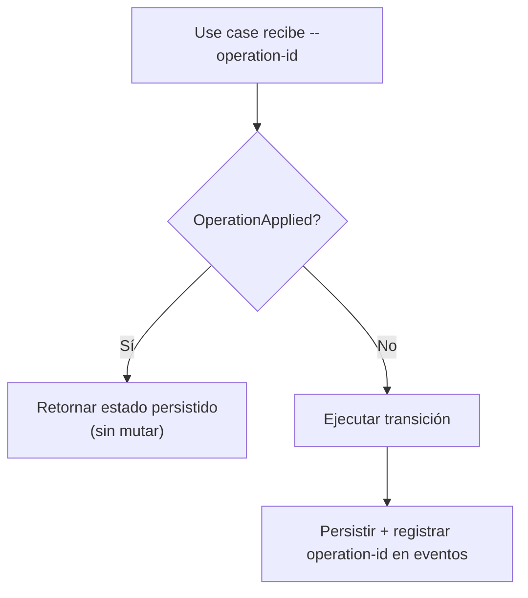
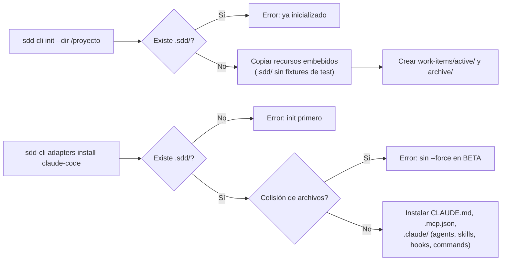
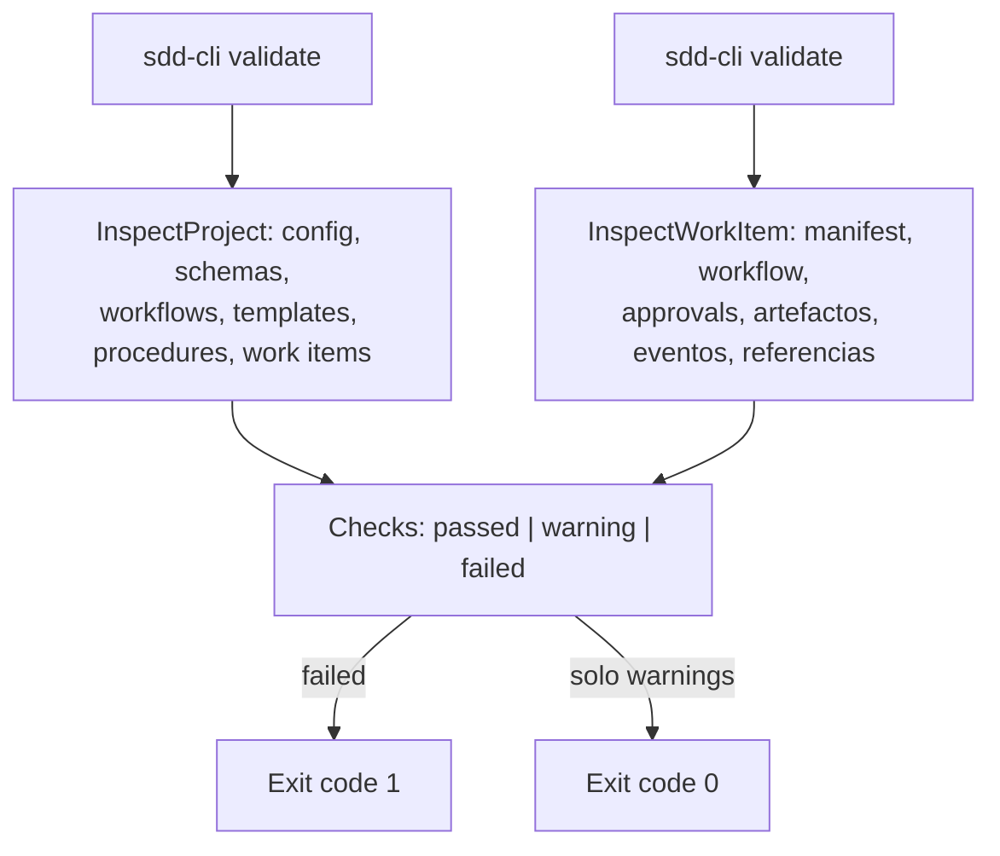

# Flujos de datos y procesos

## Flujo principal: ciclo de vida de un work item



## Flujo de inicio desde artefacto externo (`--from-artifact`)

Permite saltar fases anteriores si ya existe un artefacto aprobado fuera del work item.



## Flujo de transiciones de fase (máquina de estados)



## Flujo de persistencia transaccional

Cada mutación de `CommitWorkItem`:

1. Adquirir lock de archivo (`.lock`).
2. Verificar revisión actual del manifest (control optimista).
3. Escribir artefactos nuevos en paths temporales.
4. Serializar manifest actualizado a path temporal.
5. Append de eventos a `events.jsonl`.
6. Rename atómico de temporales a definitivos.
7. Liberar lock.

En caso de error en cualquier paso: rollback sin efectos visibles.

## Flujo de idempotencia



## Flujo de inicialización de proyecto



## Flujo de validación



## Flujo del adapter Claude Code

El adapter instala en el proyecto destino:

- `CLAUDE.md` — instrucciones del framework SDD para el agente.
- `.claude/agents/sdd-*.md` — agentes especializados (orchestrator, developer, planner, etc.).
- `.claude/skills/` — skills invocables (implement, create-plan, verify, etc.).
- `.claude/commands/sdd/` — comandos slash del adapter.
- `.claude/hooks/` — `protect-sdd-paths.py` y `protect-secrets.py`.
- `.mcp.json` — configuración de MCP para el adapter.

Una vez instalado, el agente (Claude Code) opera la CLI como motor del proceso:

```text
Agente invoca skill → Skill lee procedimiento .sdd/procedures/ → Agente produce artefacto → Agente invoca sdd-cli deliver → CLI valida y persiste
```
