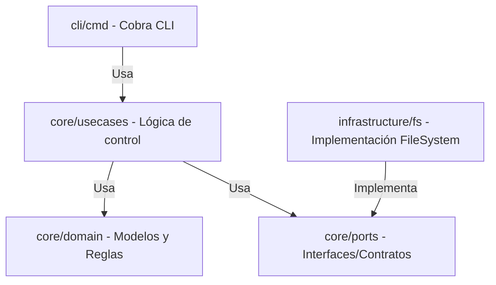

# Propuesta de Diseño: CLI del Motor SDD en Go

Esta propuesta detalla la arquitectura, el diseño interno y las decisiones de diseño para construir la CLI del motor SDD utilizando **Go**. 

Dado que es tu primer acercamiento a Go, la propuesta incluye explicaciones sobre los conceptos del lenguaje y justificaciones basadas en principios de ingeniería de software (SOLID, Clean Architecture y Patrones de Diseño).

---

## 1. Conceptos Clave de Go para este Diseño

Para entender la estructura que usaremos, aquí tienes una analogía rápida de cómo mapea Go contra otros lenguajes orientados a objetos tradicionales:

* **Packages (Paquetes)**: En Go no hay clases públicas/privadas. El encapsulamiento es a nivel de *paquete* (directorio). Si un identificador (variable, estructura, función) empieza con **Mayúscula** es público (exportado); si empieza con **minúscula** es privado al paquete.
* **Structs e Interfaces**: Go no tiene herencia (`extends`). Se usa **composición** y **polimorfismo estructural (duck typing)**. Si una estructura implementa los métodos de una `interface`, Go asume implícitamente que la implementa. Esto reduce el acoplamiento drásticamente.
* **Go Embed**: Permite incluir recursos estáticos (como archivos `.json` de schemas o plantillas de workflows) directamente adentro del binario compilado mediante comentarios especiales: `//go:embed`.

---

## 2. Arquitectura de la CLI (Clean Architecture)

Para evitar el acoplamiento y garantizar la testabilidad de la CLI, separaremos el código en capas bien definidas. El flujo de dependencias siempre irá desde afuera (CLI/Infraestructura) hacia adentro (Dominio/Core).



### Organización de Carpetas Propuesta

Creamos un módulo de Go en la raíz de nuestro desarrollo CLI (ej. `src/cli` o directamente en la raíz de `src` para compilar el motor):

```text
src/
├── .sdd/                            # Directorio del contrato (workflows, schemas, etc.)
└── sdd-cli/                         # Código fuente del motor en Go
    ├── go.mod                       # Definición de dependencias del módulo Go
    ├── main.go                      # Punto de entrada de la aplicación
    ├── internal/                    # Código privado de la aplicación (convención Go)
    │   ├── domain/                  # Entidades de negocio (WorkItem, Event, Workflow) y validación de reglas
    │   ├── ports/                   # Interfaces (Repository) para desacoplar el motor del disco
    │   ├── usecases/                # Casos de uso de negocio (Init, Start, Approve, Status)
    │   ├── infra/                   # Implementaciones concretas (FileSystem Repository, JSON Schema Validator)
    │   └── ui/                      # Manejo de la salida estándar (OutputFormatter)
    └── embeds/                      # Recursos del framework embebidos en el binario (.sdd por defecto)
```

> [!NOTE]
> La separación en `internal/` usando subcarpetas como `domain`, `ports` y `usecases` respeta el principio de **Single Responsibility (SRP)** y asegura que las reglas de transición del motor SDD no dependan de si guardamos los archivos en YAML, JSON, o en una base de datos futura.

---

## 3. Decisiones de Diseño

### 3.1. Formateo de Salida: ¿JSON Único o Texto?
> [!IMPORTANT]
> **Decisión**: Para mantener la CLI simple, robusta y con bajo costo de mantenimiento, **todas las salidas de la CLI se estructurarán internamente como JSON**.
> 
> Para no complicar la base de código manejando dos motores de renderizado distintos, la CLI siempre estructurará las respuestas usando el mismo esquema JSON. 
> - **Si se ejecuta sin `--json`**: Usaremos un formateador simple (`UIFormatter`) que tome ese mismo struct JSON y lo imprima en consola de manera human-friendly (por ejemplo, imprimiendo las fases en un formato tabular simple de texto plano).
> - **Si se ejecuta con `--json`**: Simplemente serializa el struct directamente a la salida estándar.

### 3.2. Embeber los Schemas y Templates
Para garantizar la portabilidad del motor cuando se inicialice un proyecto desde cero, utilizaremos `//go:embed` de Go.

```go
package embeds

import "embed"

// Guardamos todas las plantillas y esquemas por defecto adentro del binario
//go:embed default_sdd/**/*
var DefaultSDDResources embed.FS
```

Cuando un usuario ejecute `sdd init` en un proyecto vacío, la CLI extraerá estos archivos embebidos y creará la carpeta `.sdd/` local.

### 3.3. Inyección de Dependencias (Dependency Injection)
Para hacer la CLI totalmente testable, el caso de uso no puede instanciar directamente el lector de archivos en disco. Usaremos inyección de dependencias a través del constructor de Go:

```go
package usecases

import "sdd-cli/internal/ports"

type StartWorkItemUseCase struct {
    repo ports.WorkItemRepository
}

// Constructor (Patrón Factory en Go)
func NewStartWorkItemUseCase(r ports.WorkItemRepository) *StartWorkItemUseCase {
    return &StartWorkItemUseCase{repo: r}
}

func (uc *StartWorkItemUseCase) Execute(id string, workflowID string) error {
    // Lógica pura de transición...
    // uc.repo.Save(workItem)
    return nil
}
```

---

## 4. Comandos de la CLI Propuestos (Fase 1)

1. `sdd init`: Crea la estructura base `.sdd/` en el proyecto actual usando recursos embebidos.
2. `sdd start <work-item-id> --workflow <id> --title <title> --summary <summary>`: Crea un nuevo Work Item en estado activo.
3. `sdd status <work-item-id>`: Devuelve el estado actual, las fases y trazabilidad del ítem.
4. `sdd approve <work-item-id> --phase <phase-id> --by <human-id>`: Aprueba una fase pendiente, destrabando las fases dependientes.
5. `sdd next <work-item-id>`: Indica cuál es la fase actual `ready` y la acción permitida (o si está bloqueado esperando aprobación humana).
6. `sdd record-event <work-item-id> --type <event-type> --message <msg>`: Registra de forma manual un evento en `events.jsonl` de forma segura.

---

## 5. Preguntas de Comprensión para el Usuario

Para evaluar la comprensión y afinar el diseño antes de armar el plan de desarrollo:

1. **Sobre Composición vs Herencia en Go**: Dado que Go no permite hacer cosas como `class BugWorkItem extends WorkItem`, ¿cómo te imaginas que podemos modelar en Go las diferencias entre un WorkItem de tipo `feature` y uno de tipo `bug` manteniendo el código limpio?
2. **Uso de Interfaces**: Si mañana queremos guardar los Work Items en un backend centralizado o base de datos en lugar del sistema de archivos local (`.sdd/work-items/`), ¿por qué la arquitectura estructurada con la interfaz `ports.WorkItemRepository` nos evita tener que modificar la lógica de comandos (`cli/cmd`) y de casos de uso (`usecases`)?
