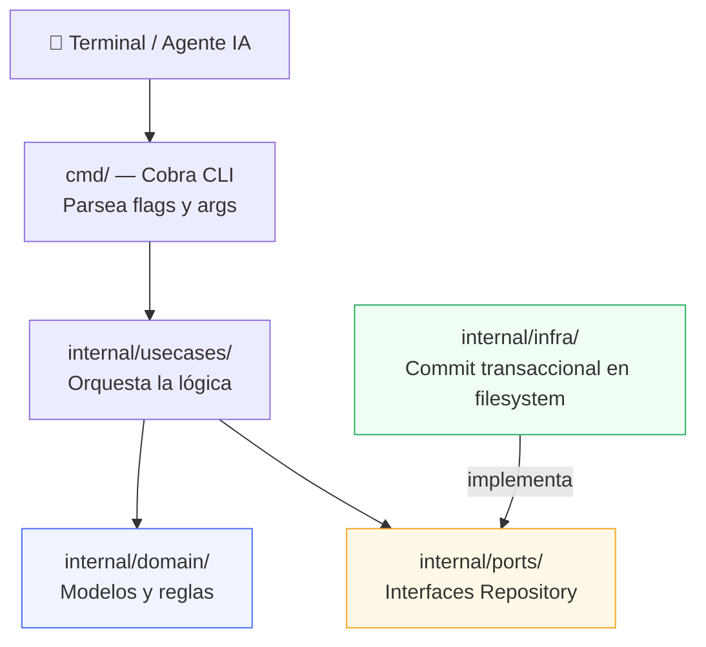
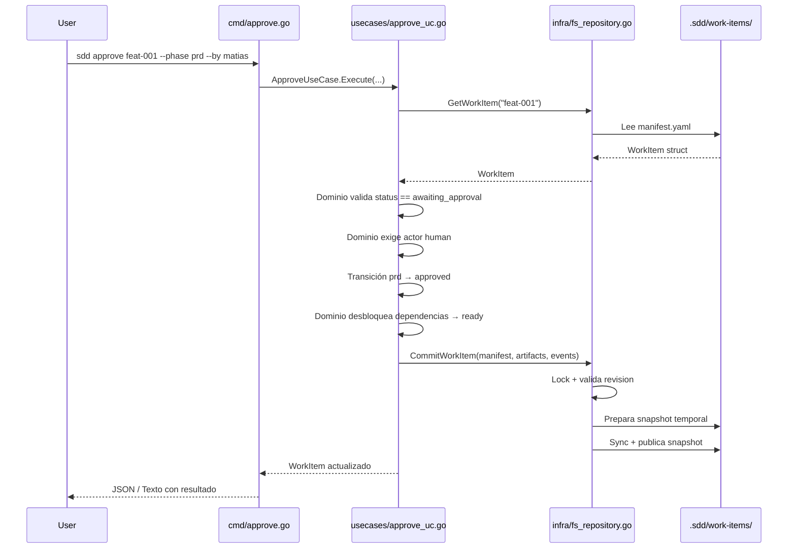
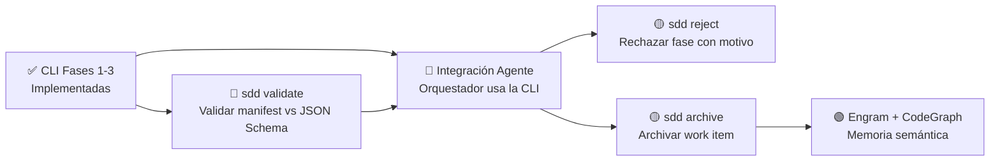

# CLI del Motor SDD — Documentación Técnica

---

## 1. Implementación: ¿Qué se construyó?

La CLI es el **motor determinista del framework SDD**: recibe comandos, valida transiciones de estado y actualiza el manifiesto (`manifest.yaml`) y la bitácora (`events.jsonl`). El LLM propone; la CLI decide si la transición es válida.

### Ubicación en el repositorio

```text
src/
├── .sdd/                    ← Contrato del motor (schemas, workflows, templates)
└── cli/                     ← Código fuente de la CLI en Go
    ├── main.go              ← Punto de entrada
    ├── go.mod / go.sum      ← Módulo y lockfile de dependencias
    ├── cmd/                 ← Capa de comandos (interfaz terminal)
    ├── embeds/              ← Archivos .sdd por defecto embebidos en el binario
    └── internal/
        ├── domain/          ← Modelos y errores del negocio
        ├── ports/           ← Interfaces/contratos de repositorios
        ├── infra/           ← Implementación en disco (YAML/JSONL)
        └── usecases/        ← Lógica de negocio orquestada
```

### Arquitectura en Capas (Clean Architecture)



### Flujo de datos: ejemplo de `sdd approve`



### Componentes por capa

| Capa | Archivos | Responsabilidad |
| :--- | :--- | :--- |
| **Domain** | `work_item.go`, `workflow.go`, `event.go`, `errors.go` | Entidades, tipos e invariantes de transición |
| **Ports** | `repository.go` | Repositorios y contrato de commit conjunto |
| **Infra** | `fs_repository.go` | Locks, revisiones, staging, rollback y recuperación de snapshots |
| **Use Cases** | `init_uc.go`, `start_uc.go`, `begin_phase_uc.go`, `deliver_phase_uc.go`, `approve_uc.go`, `complete_uc.go`, `next_uc.go`, `record_event_uc.go` | Orquestación de operaciones y persistencia |
| **CMD** | `root.go`, `init.go`, `start.go`, `status.go`, `begin.go`, `deliver.go`, `approve.go`, `complete.go`, `next.go`, `record_event.go` | Parseo de argumentos con Cobra y presentación de resultados |
| **Embeds** | `embeds.go`, `default_sdd/` | Templates de `.sdd/` embebidos en el binario para `sdd init` |

---

## 2. Cómo probar el proyecto

### A) Tests automatizados (sin compilar)

```bash
cd /Users/matiasdimuro/Documents/Webdev/sdd-harness/src/cli
/opt/homebrew/bin/go test -v ./...
```

Incluye:
- `TestContractFixtures` — valida estructural y semánticamente los fixtures JSON del contrato
- `TestFullWorkItemLifecycle` — ciclo obligatorio completo: init → start → deliver/approve → begin → implementación/verificación → code review → complete
- `TestBypassModeStart` — inicio desde artefacto externo, incluyendo el gate requerido
- `state_machine_test.go` — transiciones table-driven, gates humanos, rework y fases opcionales
- `persistence_test.go` — rollback completo, locks, revisión optimista y recuperación tras interrupciones
- `phase3_test.go` — reintentos idempotentes mediante `operation_id`

### B) Compilar el binario

```bash
cd /Users/matiasdimuro/Documents/Webdev/sdd-harness/src/cli
/opt/homebrew/bin/go build -o sdd main.go
```

Genera el ejecutable `sdd` en la misma carpeta. **No commitear este archivo.**

### C) Probar manualmente en un proyecto nuevo

```bash
# 1. Compilar
cd /Users/matiasdimuro/Documents/Webdev/sdd-harness/src/cli
/opt/homebrew/bin/go build -o sdd main.go

# 2. Crear carpeta de prueba
mkdir ~/Desktop/mi-proyecto-test
cd ~/Desktop/mi-proyecto-test

# 3. Ejecutar flujo completo
SDD=/Users/matiasdimuro/Documents/Webdev/sdd-harness/src/cli/sdd
$SDD init
$SDD start feat-001 --title "Feature de prueba" --summary "Probar el motor"
$SDD status feat-001
$SDD next feat-001
$SDD deliver feat-001 --phase prd --actor-id copilot
$SDD approve feat-001 --phase prd --by matias --comment "OK"
$SDD next feat-001 --json
$SDD begin feat-001 --phase specification --actor-id copilot
```

### D) Instalar globalmente (más cómodo)

```bash
cd /Users/matiasdimuro/Documents/Webdev/sdd-harness/src/cli
/opt/homebrew/bin/go install .
# El binario queda en ~/go/bin/sdd → usable como "sdd" desde cualquier carpeta
```

---

## 3. Comandos disponibles

Todos los comandos comparten flags globales:

| Flag | Descripción | Default |
| :--- | :--- | :--- |
| `--json` | Salida en formato JSON estructurado (para agentes IA) | `false` |
| `--dir` | Directorio raíz del proyecto destino | `.` (directorio actual) |

Los comandos mutantes (`start`, `begin`, `deliver`, `approve`, `complete` y `record-event`) aceptan `--operation-id`. El agente debe reutilizar el mismo valor al reintentar una invocación incierta; una operación ya confirmada devuelve el estado existente sin duplicar eventos ni aumentar la revisión.

La v0.1 admite múltiples lectores, pero sólo un escritor simultáneo por work item. Cada mutación confirma conjuntamente manifest, artifacts y eventos; una revisión obsoleta o un lock ocupado producen error sin sobrescribir estado.

---

### `sdd init`
Inicializa la estructura `.sdd/` en el proyecto actual desde las plantillas embebidas en el binario.

```bash
sdd init
sdd init --dir /ruta/a/mi-proyecto
```

> ⚠️ Falla si `.sdd/` ya existe. No inicializa Git.

---

### `sdd start <id>`
Crea un nuevo work item activo con su manifiesto y bitácora de eventos.

```bash
# Inicio estándar desde prompt
sdd start feat-023 --title "Cupones en checkout" --summary "Agregar campo de cupón"

# Inicio desde artefacto existente (bypass de fase prd)
sdd start feat-023 \
  --title "Cupones en checkout" \
  --from-artifact ./mi-prd.md \
  --phase prd
```

| Flag | Obligatorio | Default | Descripción |
| :--- | :--- | :--- | :--- |
| `--title` / `-t` | ✅ | — | Título del work item |
| `--workflow` / `-w` | ❌ | `defaults.workflow` de `.sdd/config.yaml` | ID del workflow a usar |
| `--summary` / `-s` | ❌ | — | Resumen del input inicial |
| `--from-artifact` | ❌ | — | Ruta a un artefacto externo existente |
| `--phase` | ❌* | — | Fase de entrada al usar `--from-artifact` |
| `--actor-kind` | ❌ | `human` | Tipo de actor creador |
| `--actor-id` | ❌ | `user` | ID del actor creador |
| `--operation-id` | ❌ | — | Clave estable para reintentos idempotentes |

> *Requerido si se usa `--from-artifact`

---

### `sdd status <id>`
Muestra el estado actual de todas las fases del work item.

```bash
sdd status feat-023
sdd status feat-023 --json
```

**Salida texto:**
```text
Work Item: feat-023 [active]
Title: Cupones en checkout
Workflow: feature-standard
------------------------------------------------------
PHASE                STATUS               ARTIFACT
------------------------------------------------------
prd                  approved             artifacts/prd.md
specification        ready                artifacts/specification.md
plan                 blocked              -
```

---

### `sdd approve <id>`
Registra la aprobación humana de una fase, desbloqueando automáticamente las fases dependientes.

```bash
sdd approve feat-023 --phase prd --by matias
sdd approve feat-023 --phase specification --by matias --comment "Revisado y OK"
```

| Flag | Obligatorio | Default | Descripción |
| :--- | :--- | :--- | :--- |
| `--phase` / `-p` | ✅ | — | ID de la fase a aprobar |
| `--by` / `-b` | ❌ | `human` | ID del aprobador humano |
| `--comment` / `-c` | ❌ | — | Comentario opcional |
| `--operation-id` | ❌ | — | Clave estable para reintentos idempotentes |

> Sólo aprueba fases en estado `awaiting_approval`, con política `required` u `optional`. La invariante de actor humano vive en el dominio, no sólo en Cobra.

---

### `sdd begin <id>`
Comienza explícitamente una fase `ready`, `rejected` o `superseded`.

```bash
sdd begin feat-023 --phase specification --actor-kind agent --actor-id copilot
sdd begin feat-023 --phase specification --operation-id run:specification:begin:001
```

`next` nunca realiza esta transición: sólo informa qué fase corresponde.

---

### `sdd deliver <id>`
Entrega la evidencia de una fase `in_progress`.

```bash
sdd deliver feat-023 --phase specification --actor-id copilot
sdd deliver feat-023 --phase archive --request-approval
sdd deliver feat-023 --phase specification --operation-id run:specification:deliver:001
```

- `approval: required` produce `awaiting_approval`.
- `approval: optional` produce `completed`, salvo que se use `--request-approval`.
- `approval: none` produce `completed` y rechaza `--request-approval`.

---

### `sdd complete <id>`
Completa una fase `approved`/`accepted`, o el work item si se omite `--phase`.

```bash
sdd complete feat-023 --phase prd
sdd complete feat-023
sdd complete feat-023 --operation-id run:work-item:complete:001
```

El work item sólo puede completarse cuando todas las fases obligatorias están satisfechas. Una fase opcional puede omitirse, pero si comenzó también debe terminar.

---

### `sdd next <id>`
Informa cuál es la próxima fase activa, qué procedimiento seguir y si requiere aprobación humana. Es una consulta pura: no escribe el manifest ni inicia la fase.

```bash
sdd next feat-023
sdd next feat-023 --json
```

**Salida JSON:**
```json
{
  "success": true,
  "data": {
    "phase_id": "specification",
    "status": "ready",
    "procedure": "generate-specification",
    "artifact": "artifacts/specification.md",
    "needs_approval": true,
    "optional": false,
    "message": "Next active phase is 'specification' (ready). Follow procedure 'generate-specification'."
  }
}
```

---

### `sdd record-event <id>`
Inyecta un evento personalizado de forma inmutable en `events.jsonl`.

```bash
sdd record-event feat-023 --type validation.completed --message "Tests pasaron OK"
sdd record-event feat-023 \
  --type custom.checkpoint \
  --message "Revisión intermedia" \
  --actor-kind agent \
  --actor-id planner
```

| Flag | Obligatorio | Default | Descripción |
| :--- | :--- | :--- | :--- |
| `--type` / `-t` | ✅ | — | Tipo de evento (ej: `validation.completed`) |
| `--message` / `-m` | ❌ | — | Descripción del evento |
| `--actor-kind` | ❌ | `agent` | Tipo de actor (`human`, `agent`, `cli`, `system`) |
| `--actor-id` | ❌ | `agent` | ID del actor |
| `--operation-id` | ❌ | — | Clave estable para reintentos idempotentes |

---

## 4. Próximos pasos



| Prioridad | Paso | Descripción |
| :--- | :--- | :--- |
| 🔴 Alta | **`sdd validate`** | Exponer una validación explícita bajo demanda; las operaciones actuales ya validan schemas y semántica al cargar/persistir |
| 🔴 Alta | **Integración del agente orquestador** | Instruir al agente (via `AGENTS.md` o skill) para que invoque la CLI como autoridad de estado |
| 🟡 Media | **`sdd reject`** | Rechazar una fase con motivo, bloqueando el flujo hasta nueva generación |
| 🟡 Media | **`sdd archive <id>`** | Mover un work item completado de `active/` a `archive/YYYY-MM-DD-<id>/` |
| 🟢 Baja | **Validación de Event Types** | Validar que el tipo en `record-event` respete el patrón del schema |
| 🟢 Baja | **Engram + CodeGraph** | Integración con memoria semántica (fuera del scope de Fase 1) |

---

*Motor SDD CLI v0.1 — Implementado el 2026-08-15*
