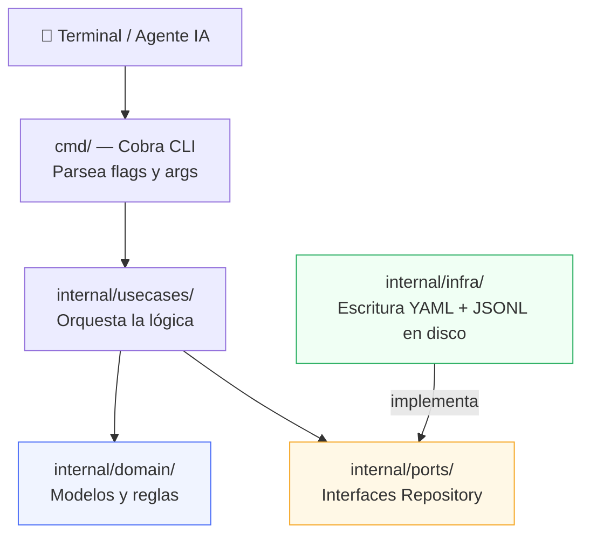
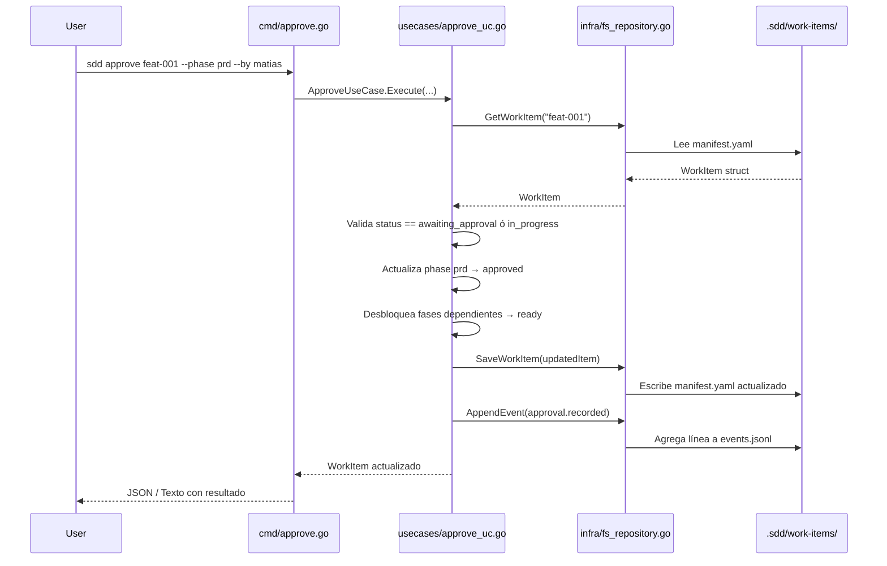

# CLI del Motor SDD — Documentación Técnica

---

## 1. Implementación: ¿Qué se construyó?

La CLI es el **motor determinista del framework SDD**: recibe comandos, valida transiciones de estado y actualiza el manifiesto (`manifest.yaml`) y la bitácora (`events.jsonl`). El LLM propone; la CLI decide si la transición es válida.

### Ubicación en el repositorio

```text
src/
├── .sdd/                    ← Contrato del motor (schemas, workflows, templates)
└── cli/                     ← Código fuente de la CLI en Go
    ├── main.go              ← Punto de entrada
    ├── go.mod / go.sum      ← Módulo y lockfile de dependencias
    ├── cmd/                 ← Capa de comandos (interfaz terminal)
    ├── embeds/              ← Archivos .sdd por defecto embebidos en el binario
    └── internal/
        ├── domain/          ← Modelos y errores del negocio
        ├── ports/           ← Interfaces/contratos de repositorios
        ├── infra/           ← Implementación en disco (YAML/JSONL)
        └── usecases/        ← Lógica de negocio orquestada
```

### Arquitectura en Capas (Clean Architecture)



### Flujo de datos: ejemplo de `sdd approve`



### Componentes por capa

| Capa | Archivos | Responsabilidad |
| :--- | :--- | :--- |
| **Domain** | `work_item.go`, `workflow.go`, `event.go`, `errors.go` | Definir las entidades y errores del contrato |
| **Ports** | `repository.go` | Interfaces `WorkItemRepository` y `WorkflowRepository` |
| **Infra** | `fs_repository.go` | Leer/escribir YAML (manifiestos) y JSONL (eventos) en disco |
| **Use Cases** | `init_uc.go`, `start_uc.go`, `status_uc.go`, `approve_uc.go`, `next_uc.go`, `record_event_uc.go` | Lógica de negocio pura, testeable e independiente del disco |
| **CMD** | `root.go`, `init.go`, `start.go`, `status.go`, `approve.go`, `next.go`, `record_event.go` | Parseo de argumentos con Cobra, presentación de resultados |
| **Embeds** | `embeds.go`, `default_sdd/` | Templates de `.sdd/` embebidos en el binario para `sdd init` |

---

## 2. Cómo probar el proyecto

### A) Tests automatizados (sin compilar)

```bash
cd /Users/matiasdimuro/Documents/Webdev/sdd-harness/src/cli
/opt/homebrew/bin/go test -v ./...
```

Incluye:
- `TestParseValidFixtures` — parsea los 7 fixtures JSON del contrato (en `src/.sdd/tests/fixtures/valid/`)
- `TestFullWorkItemLifecycle` — ciclo completo: init → start → status → approve → next → record-event
- `TestBypassModeStart` — inicio desde artefacto externo existente (bypass de fases)

### B) Compilar el binario

```bash
cd /Users/matiasdimuro/Documents/Webdev/sdd-harness/src/cli
/opt/homebrew/bin/go build -o sdd main.go
```

Genera el ejecutable `sdd` en la misma carpeta. **No commitear este archivo.**

### C) Probar manualmente en un proyecto nuevo

```bash
# 1. Compilar
cd /Users/matiasdimuro/Documents/Webdev/sdd-harness/src/cli
/opt/homebrew/bin/go build -o sdd main.go

# 2. Crear carpeta de prueba
mkdir ~/Desktop/mi-proyecto-test
cd ~/Desktop/mi-proyecto-test

# 3. Ejecutar flujo completo
SDD=/Users/matiasdimuro/Documents/Webdev/sdd-harness/src/cli/sdd
$SDD init
$SDD start feat-001 --title "Feature de prueba" --summary "Probar el motor"
$SDD status feat-001
$SDD next feat-001
$SDD approve feat-001 --phase prd --by matias --comment "OK"
$SDD next feat-001 --json
```

### D) Instalar globalmente (más cómodo)

```bash
cd /Users/matiasdimuro/Documents/Webdev/sdd-harness/src/cli
/opt/homebrew/bin/go install .
# El binario queda en ~/go/bin/sdd → usable como "sdd" desde cualquier carpeta
```

---

## 3. Comandos disponibles

Todos los comandos comparten flags globales:

| Flag | Descripción | Default |
| :--- | :--- | :--- |
| `--json` | Salida en formato JSON estructurado (para agentes IA) | `false` |
| `--dir` | Directorio raíz del proyecto destino | `.` (directorio actual) |

---

### `sdd init`
Inicializa la estructura `.sdd/` en el proyecto actual desde las plantillas embebidas en el binario.

```bash
sdd init
sdd init --dir /ruta/a/mi-proyecto
```

> ⚠️ Falla si `.sdd/` ya existe. No inicializa Git.

---

### `sdd start <id>`
Crea un nuevo work item activo con su manifiesto y bitácora de eventos.

```bash
# Inicio estándar desde prompt
sdd start feat-023 --title "Cupones en checkout" --summary "Agregar campo de cupón"

# Inicio desde artefacto existente (bypass de fase prd)
sdd start feat-023 \
  --title "Cupones en checkout" \
  --from-artifact ./mi-prd.md \
  --phase prd
```

| Flag | Obligatorio | Default | Descripción |
| :--- | :--- | :--- | :--- |
| `--title` / `-t` | ✅ | — | Título del work item |
| `--workflow` / `-w` | ❌ | `feature-standard` | ID del workflow a usar |
| `--summary` / `-s` | ❌ | — | Resumen del input inicial |
| `--from-artifact` | ❌ | — | Ruta a un artefacto externo existente |
| `--phase` | ❌* | — | Fase de entrada al usar `--from-artifact` |
| `--actor-kind` | ❌ | `human` | Tipo de actor creador |
| `--actor-id` | ❌ | `user` | ID del actor creador |

> *Requerido si se usa `--from-artifact`

---

### `sdd status <id>`
Muestra el estado actual de todas las fases del work item.

```bash
sdd status feat-023
sdd status feat-023 --json
```

**Salida texto:**
```text
Work Item: feat-023 [active]
Title: Cupones en checkout
Workflow: feature-standard
------------------------------------------------------
PHASE                STATUS               ARTIFACT
------------------------------------------------------
prd                  approved             artifacts/prd.md
specification        ready                artifacts/specification.md
plan                 blocked              -
```

---

### `sdd approve <id>`
Registra la aprobación humana de una fase, desbloqueando automáticamente las fases dependientes.

```bash
sdd approve feat-023 --phase prd --by matias
sdd approve feat-023 --phase specification --by matias --comment "Revisado y OK"
```

| Flag | Obligatorio | Default | Descripción |
| :--- | :--- | :--- | :--- |
| `--phase` / `-p` | ✅ | — | ID de la fase a aprobar |
| `--by` / `-b` | ❌ | `human` | ID del aprobador humano |
| `--comment` / `-c` | ❌ | — | Comentario opcional |

> ⚠️ Solo aprueba fases en estado `awaiting_approval` o `in_progress`. La CLI no permite autoaprobación de agentes.

---

### `sdd next <id>`
Informa cuál es la próxima fase activa, qué procedimiento seguir y si requiere aprobación humana.

```bash
sdd next feat-023
sdd next feat-023 --json
```

**Salida JSON:**
```json
{
  "success": true,
  "data": {
    "phase_id": "specification",
    "status": "ready",
    "procedure": "generate-specification",
    "artifact": "artifacts/specification.md",
    "needs_approval": true,
    "message": "Next active phase is 'specification' (ready)."
  }
}
```

---

### `sdd record-event <id>`
Inyecta un evento personalizado de forma inmutable en `events.jsonl`.

```bash
sdd record-event feat-023 --type validation.completed --message "Tests pasaron OK"
sdd record-event feat-023 \
  --type custom.checkpoint \
  --message "Revisión intermedia" \
  --actor-kind agent \
  --actor-id planner
```

| Flag | Obligatorio | Default | Descripción |
| :--- | :--- | :--- | :--- |
| `--type` / `-t` | ✅ | — | Tipo de evento (ej: `validation.completed`) |
| `--message` / `-m` | ❌ | — | Descripción del evento |
| `--actor-kind` | ❌ | `agent` | Tipo de actor (`human`, `agent`, `cli`, `system`) |
| `--actor-id` | ❌ | `agent` | ID del actor |

---

## 4. Próximos pasos


| Prioridad | Paso | Descripción |
| :--- | :--- | :--- |
| 🔴 Alta | **`sdd validate`** | Validar `manifest.yaml` contra los JSON Schemas de `.sdd/schemas/` antes de cualquier operación mutante |
| 🔴 Alta | **Integración del agente orquestador** | Instruir al agente (via `AGENTS.md` o skill) para que invoque la CLI como autoridad de estado |
| 🟡 Media | **`sdd reject`** | Rechazar una fase con motivo, bloqueando el flujo hasta nueva generación |
| 🟡 Media | **`sdd archive <id>`** | Mover un work item completado de `active/` a `archive/YYYY-MM-DD-<id>/` |
| 🟢 Baja | **Validación de Event Types** | Validar que el tipo en `record-event` respete el patrón del schema |
| 🟢 Baja | **Engram + CodeGraph** | Integración con memoria semántica (fuera del scope de Fase 1) |

---

*Motor SDD CLI v0.1 — Implementado el 2026-08-15*
