# Guia tecnica de la CLI del motor SDD

> Estado: documentacion de la implementacion actual.  
> Audiencia: desarrolladores que se incorporan al proyecto, con experiencia en JavaScript/TypeScript o Java y sin experiencia previa en Go.  
> Alcance: contrato instalado en `src/.sdd/` y motor implementado en `src/cli/`.  
> Version documentada: contrato y CLI v0.1, estado al 2026-08-19.

---

## 1. Objetivo de este documento

Este documento explica la CLI como un sistema completo:

- que problema resuelve dentro del harness;
- que funcionalidades soporta hoy;
- que workflows gobierna;
- por que se eligio Go y sus librerias principales;
- como esta organizada la arquitectura;
- como interactuan las capas y componentes;
- como fluyen los datos desde un comando hasta el filesystem;
- que garantias de seguridad, consistencia e idempotencia ofrece;
- que partes siguen fuera del alcance actual.

La informacion se reconstruyo cruzando:

1. el contrato vigente de `src/.sdd/`;
2. el codigo de produccion de `src/cli/`;
3. la suite contractual y end-to-end;
4. los documentos de diseño, implementacion y auditoria previos.

Cuando existe una diferencia entre una idea historica y el comportamiento actual, este documento prioriza el codigo y el contrato ejecutable.

---

## 2. Resumen ejecutivo

La CLI `sdd-cli` es el **motor determinista** del framework de Spec-Driven Development.

Su responsabilidad no es redactar documentos, programar una feature ni decidir que modelo de IA usar. Su responsabilidad es gobernar el proceso:

- crear instancias de trabajo;
- conocer el estado de cada fase;
- validar transiciones;
- impedir saltos no permitidos;
- exigir gates humanos;
- preparar los artifacts definidos por el workflow;
- registrar eventos auditables;
- persistir el cambio completo de forma consistente.

La separacion conceptual mas importante es:

```text
Agente o persona: realiza trabajo cognitivo y propone acciones.
CLI: valida reglas, cambia estado y registra evidencia.
```

Ejemplo:

```text
El agente redacta el plan.
El agente ejecuta `sdd-cli deliver ... --phase plan`.
La CLI verifica que `plan` estaba en progreso.
La CLI lo deja esperando aprobacion.
Una persona ejecuta `sdd-cli approve ... --phase plan`.
La CLI registra la aprobacion y desbloquea `implementation`.
```

Esto evita depender de que el LLM recuerde correctamente el estado del proceso a partir del chat.

---

## 3. Que es y que no es la CLI

### 3.1. Que es

La CLI es:

- una interfaz de linea de comandos;
- una maquina de estados para work items y fases;
- un interprete de workflows declarativos;
- un validador estructural y semantico;
- un coordinador de persistencia transaccional sobre filesystem;
- una fuente de respuestas estructuradas para agentes;
- un productor de trazabilidad mediante eventos JSONL.

### 3.2. Que no es

La CLI no:

- genera por si sola el contenido intelectual de un PRD, plan o especificacion;
- modifica codigo como parte de una fase;
- ejecuta commits, pushes o pull requests;
- elige agentes, modelos, skills o MCPs;
- reemplaza al orquestador;
- reemplaza Git como fuente de verdad;
- mantiene una base de datos oculta;
- archiva fisicamente work items todavia.

Los campos `procedure` y `effects` del workflow describen que debe hacerse, pero el motor no ejecuta esas herramientas. Esa responsabilidad pertenece al agente o adaptador.

---

## 4. Conceptos de dominio

| Concepto | Significado | Ejemplo |
| --- | --- | --- |
| **Workflow** | Plantilla declarativa de un proceso. Define fases, dependencias, artifacts y gates. | `feature-standard` |
| **Work item** | Instancia concreta de un workflow. | `feat-add-coupons` |
| **Fase** | Unidad de trabajo gobernada por estados. | `plan`, `implementation` |
| **Artifact** | Documento Markdown producido como evidencia de una fase. | `artifacts/plan.md` |
| **Manifest** | Snapshot YAML del estado actual del work item. | `manifest.yaml` |
| **Evento** | Registro inmutable de una accion o transicion. | `phase.transitioned` |
| **Gate** | Decision requerida antes de continuar. | Aprobacion humana del plan |
| **Entry point** | Fase desde la cual el workflow permite comenzar. | `prd`, `specification`, `plan` |
| **Procedure** | Instrucción portable o habilidad (skill) que guía sobre cómo realizar una acción, investigación o documentación en el workflow. | `procedures/create-plan.md` |
| **Operation ID** | Clave estable usada para reintentar una mutacion sin duplicarla. | `run:plan:deliver:001` |
| **Actor** | Identidad que ejecuta una operacion. | `{kind: agent, id: copilot}` |

### 4.1. Las tres fuentes de informacion de un work item

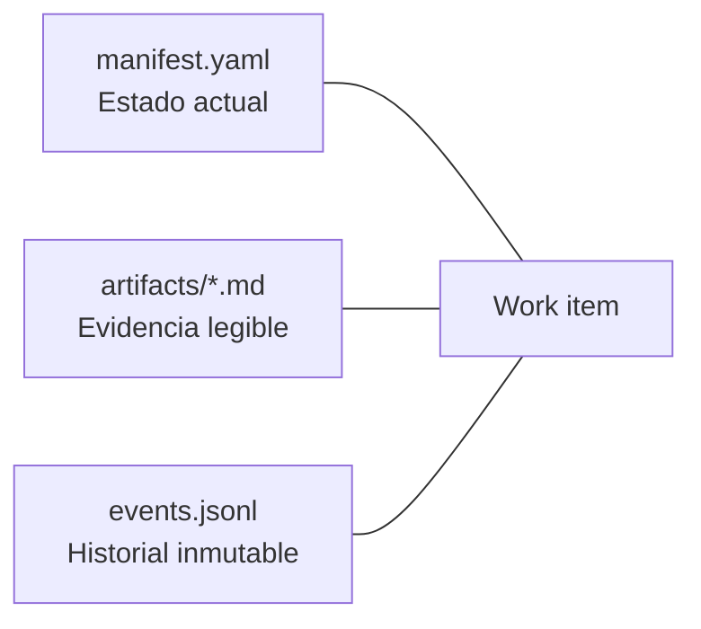

- El **manifest** responde: "¿en que estado esta ahora?".
- Los **artifacts** responden: "¿que produjo cada fase?".
- Los **eventos** responden: "¿como llego hasta este estado?".

El estado no se deduce leyendo el chat ni buscando checkboxes dentro de Markdown.

---

## 5. Por que se utiliza Go

La elección de Go para el motor de la CLI responde a eliminar la fricción de distribución y entorno que sufren otras tecnologías. En lugar de obligar al usuario (o al agente) a lidiar con instalaciones de Node.js/Python, resolver conflictos de `node_modules` o configurar entornos virtuales (`venv`), Go compila a un **binario nativo único y estático**. Esto garantiza un arranque instantáneo (sin tiempo de carga de máquinas virtuales) y una portabilidad absoluta en cualquier sistema operativo simplemente copiando el archivo, manteniendo el motor ligero, determinista y autocontenido.

### 5.1. Justificacion tecnica

| Necesidad del motor | Aporte de Go |
| --- | --- |
| Distribuir la herramienta de forma portable | Genera un binario autocontenido por plataforma (platform-agnostic) |
| Ser agent-agnostic / framework-agnostic | Se logra por diseño de arquitectura (intercambio de archivos), mientras que Go simplifica la ejecución directa de este diseño sin dependencias |
| Mantener reglas deterministas | Tipos estaticos y compilacion previa |
| Operar sobre filesystem | Libreria estandar madura y multiplataforma |
| Probar dependencias externas | Interfaces implicitas y composicion simple |
| Incluir recursos base | `go:embed` integra `.sdd/` dentro del binario |
| Evitar configuracion compleja | `go test`, `go build`, `go vet` y `gofmt` vienen con el toolchain |
| Controlar concurrencia local | Locks de archivo y manejo explicito de errores |

### 5.2. Dependencias externas

| Libreria | Funcion |
| --- | --- |
| `github.com/spf13/cobra` | Parseo de comandos, argumentos y flags |
| `gopkg.in/yaml.v3` | Lectura y escritura de YAML |
| `github.com/santhosh-tekuri/jsonschema/v5` | Validacion contra JSON Schema |
| `github.com/gofrs/flock` | Lock exclusivo por work item |

No se usa un framework de aplicacion ni una base de datos.

---

## 6. Introduccion a Go aplicada a este codebase

### 6.1. Equivalencias utiles

| Go | JavaScript/TypeScript | Java |
| --- | --- | --- |
| `package` | Modulo/carpeta | Package |
| `struct` | Objeto tipado o `interface` de datos | Clase de datos/record |
| Metodo con receiver | Metodo de objeto | Metodo de instancia |
| `interface` | Interface estructural de TypeScript | Interface, pero implementada implicitamente |
| Funcion constructora `NewX` | Factory function | Constructor/factory |
| Composicion de interfaces | `extends` de interfaces | `extends` de interfaces |
| `error` como retorno | `throw`/`Promise.reject` | Excepcion checked conceptualmente |
| Exportado con mayuscula | `export` | `public` |
| Minuscula inicial | Privado al package | Package-private/private aproximado |

### 6.2. No hay clases ni herencia

El dominio se modela con structs y metodos:

```go
type WorkItem struct {
    ID     string
    Status WorkItemStatus
    Phases map[string]PhaseState
}

func (item *WorkItem) BeginPhase(
    workflow *Workflow,
    phaseID string,
) (PhaseMutation, error) {
    // Regla de negocio.
}
```

`(item *WorkItem)` es el **receiver**. Es comparable a un metodo de instancia:

```ts
class WorkItem {
  beginPhase(workflow: Workflow, phaseID: string): PhaseMutation {}
}
```

El puntero `*WorkItem` permite modificar la misma instancia.

### 6.3. Las interfaces se implementan implicitamente

```go
type WorkItemReader interface {
    GetWorkItem(baseDir string, id string) (*domain.WorkItem, error)
}
```

`FSWorkItemRepository` implementa esa interfaz porque posee un metodo con la misma firma. No existe `implements WorkItemReader`.

Esto permite que un use case reciba:

- el repositorio real de filesystem en produccion;
- un doble en memoria durante un test.

### 6.4. Manejo de errores

Go representa los fallos como valores:

```go
item, err := repo.GetWorkItem(baseDir, id)
if err != nil {
    return nil, fmt.Errorf("failed to get work item: %w", err)
}
```

`%w` agrega contexto sin perder la causa original. Luego `errors.Is` permite clasificar el error en la capa CLI.

No hay excepciones que atraviesen la aplicacion implicitamente: cada funcion decide si maneja o propaga el error.

### 6.5. `internal/`

Go reserva semanticamente el directorio `internal/`: sus packages no pueden importarse desde fuera del arbol permitido.

En esta CLI ayuda a indicar que `domain`, `ports`, `usecases` e `infra` son detalles internos del ejecutable y no una libreria publica estable.

---

## 7. Tecnologia y formatos de persistencia

| Informacion | Formato | Motivo |
| --- | --- | --- |
| Configuracion | YAML | Legible y editable por proyecto |
| Workflows | YAML | Permite declarar el proceso como datos |
| Manifest | YAML | Facil de revisar y versionar |
| Artifacts | Markdown con front matter YAML | Legibles por humanos y procesables por maquinas |
| Eventos | JSON Lines | Append-only y procesable linea por linea |
| Contratos | JSON Schema | Validacion interoperable y determinista |

La CLI no persiste estado fuera de `.sdd/`.

---

## 8. Estructura del proyecto

### 8.1. Contrato fuente

`src/.sdd/` contiene la definicion portable del motor:

```text
src/.sdd/
├── config.yaml
├── schemas/
├── workflows/
├── templates/
├── procedures/
├── registry/
├── context/
├── specs/
├── research/
├── tests/
└── work-items/
```

Este directorio es la fuente de verdad para workflows, schemas, templates y procedimientos incluidos en el framework.

### 8.2. Codigo Go

```text
src/cli/
├── main.go
├── generate.go
├── go.mod
├── cmd/
├── embeds/
├── internal/
│   ├── domain/
│   ├── ports/
│   ├── usecases/
│   └── infra/
└── tools/
    └── syncsdd/
```

### 8.3. Estructura instalada en un proyecto usuario

Luego de `sdd-cli init`:

```text
mi-proyecto/
└── .sdd/
    ├── config.yaml
    ├── schemas/
    ├── workflows/
    ├── templates/
    ├── procedures/
    ├── registry/
    ├── context/
    ├── specs/
    ├── research/
    └── work-items/
        ├── active/
        └── archive/
```

Los fixtures contractuales de `tests/` no se instalan en el proyecto usuario.

### 8.4. Estructura de un work item activo

```text
.sdd/work-items/active/<id>/
├── manifest.yaml
├── events.jsonl
├── artifacts/
│   ├── plan.md
│   └── ...
└── evidence/
```

`evidence/` esta preparado para outputs crudos, screenshots o reportes, aunque la CLI actual no posee un comando especifico para administrarlos.

---

## 9. Recursos embebidos e inicializacion

El binario debe poder ejecutar `sdd-cli init` sin depender de la ubicacion del repositorio original. Para eso utiliza `go:embed`.

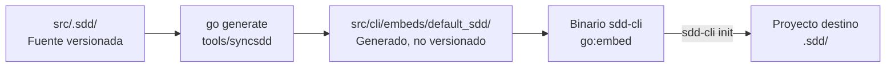

Puntos importantes:

- `src/.sdd/` se versiona.
- `src/cli/embeds/default_sdd/` es generado y esta en `.gitignore`.
- `generate.go` declara `//go:generate go run tools/syncsdd/main.go`.
- `embeds/embeds.go` incluye el directorio generado con `//go:embed`.
- `sdd-cli init` publica la copia embebida en el proyecto destino.

En un checkout limpio debe sincronizarse el embed antes de compilar:

```bash
cd src/cli
go generate ./...
go build
```

---

## 10. Arquitectura de alto nivel

La implementacion sigue una variante pragmatica de Clean Architecture con ports and adapters.

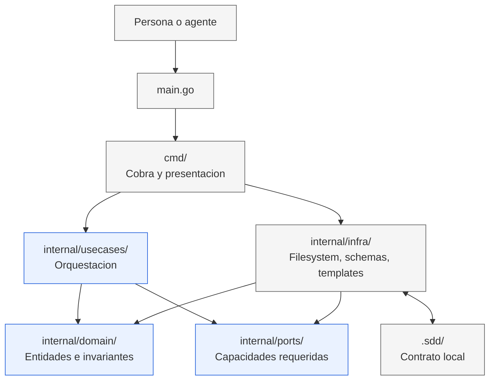

### 10.1. Regla de dependencias

La direccion importante es:

```text
cmd -> usecases -> domain
                 -> ports
infra ---------> domain + ports
```

Los use cases no importan `infra`. Conocen interfaces pequenas definidas en `ports`.

`cmd/composition.go` es la excepcion intencional donde se conectan las implementaciones reales. Ese archivo es el **composition root**.

### 10.2. Responsabilidades por capa

| Capa | Responsabilidad | No deberia hacer |
| --- | --- | --- |
| `cmd` | Parsear input, ejecutar use cases y presentar output | Decidir transiciones |
| `usecases` | Orquestar una operacion completa | Conocer detalles de archivos o Cobra |
| `domain` | Modelar estados, reglas e invariantes | Leer disco o imprimir output |
| `ports` | Declarar capacidades externas requeridas | Implementar filesystem |
| `infra` | Implementar persistencia, schemas, templates, tiempo e IDs | Decidir reglas de negocio |
| `.sdd` | Declarar workflows, templates y contratos | Ejecutar operaciones |

---

## 11. Componentes principales del codigo

### 11.1. `main.go`

Es el punto de entrada minimo:

```go
func main() {
    if err := cmd.Execute(); err != nil {
        os.Exit(1)
    }
}
```

Es el unico lugar que convierte un error en exit code `1`.

### 11.2. `cmd/root.go`

El root command:

- registra flags globales;
- agrega todos los subcomandos;
- centraliza success y error output;
- convierte errores de dominio en codigos JSON estables;
- separa stdout y stderr.

### 11.3. `cmd/composition.go`

Construye las dependencias productivas una sola vez:

```text
FS repositories
ArtifactManager
SystemClock
CryptoIDGenerator
        |
        v
Use cases
        |
        v
Comandos Cobra
```

Esto evita que cada comando cree su propio repositorio o que un use case conozca implementaciones concretas.

### 11.4. `internal/domain`

Contiene:

- `WorkItem`;
- `Workflow`;
- estados de fase y work item;
- approvals;
- actors y events;
- validacion semantica;
- construccion inicial del agregado;
- maquina de estados.

Es el nucleo con mayor valor de negocio.

### 11.5. `internal/ports`

Divide capacidades segun el consumidor:

| Port | Capacidad |
| --- | --- |
| `WorkItemReader` | Leer un work item |
| `WorkItemExistenceChecker` | Detectar colisiones de ID |
| `OperationTracker` | Consultar si un operation ID ya fue aplicado |
| `WorkItemCommitter` | Confirmar manifest, artifacts y eventos |
| `WorkflowRepository` | Cargar un workflow |
| `ConfigRepository` | Cargar defaults del proyecto |
| `ArtifactPreparer` | Preparar artifacts desde templates |
| `ExternalArtifactImporter` | Resolver e importar input externo |
| `ProjectInitializer` | Inicializar `.sdd/` |
| `Clock` | Proveer timestamps |
| `IDGenerator` | Generar IDs de eventos |

Las interfaces compuestas:

```go
type WorkItemMutationRepository interface {
    WorkItemReader
    OperationTracker
    WorkItemCommitter
}
```

son comparables a:

```ts
interface WorkItemMutationRepository
  extends WorkItemReader, OperationTracker, WorkItemCommitter {}
```

### 11.6. `internal/usecases`

Cada operacion publica tiene un caso de uso:

- `InitUseCase`;
- `StartWorkItemUseCase`;
- `StatusUseCase`;
- `NextUseCase`;
- `BeginPhaseUseCase`;
- `DeliverPhaseUseCase`;
- `ApproveUseCase`;
- `CompleteUseCase`;
- `RecordEventUseCase`.

`transition_helpers.go` concentra pasos compartidos:

- cargar item y workflow;
- consultar idempotencia;
- preparar artifacts desbloqueados;
- generar eventos;
- confirmar el commit.

### 11.7. `internal/infra`

Implementa:

- repositorios YAML/filesystem;
- persistencia por snapshots;
- locks y revision optimista;
- recuperacion de transacciones interrumpidas;
- validacion JSON Schema;
- seguridad de paths y symlinks;
- renderizado/importacion de artifacts;
- inicializacion atomica;
- reloj real;
- IDs criptograficos.

---

## 12. Funcionalidades soportadas

### 12.1. Flags globales

| Flag | Default | Funcion |
| --- | --- | --- |
| `--dir` | `.` | Define el proyecto que contiene `.sdd/` |
| `--json` | `false` | Devuelve un envelope JSON para integraciones |

### 12.2. Matriz de comandos

| Comando | Tipo | Funcion | Modifica estado | `--operation-id` |
| --- | --- | --- | --- | --- |
| `sdd init` | Inicializacion | Instala `.sdd/` | Si | No |
| `sdd start` | Creacion | Crea un work item | Si | Si |
| `sdd status` | Consulta | Muestra manifest y fases | No | No |
| `sdd next` | Consulta | Informa la proxima accion | No | No |
| `sdd validate` | Diagnostico | Valida proyecto o work item activo/archivado | No | No |
| `sdd begin` | Transicion | Inicia una fase habilitada | Si | Si |
| `sdd deliver` | Transicion | Entrega el resultado de una fase | Si | Si |
| `sdd approve` | Gate humano | Aprueba una fase | Si | Si |
| `sdd reject` | Gate humano | Rechaza una fase para retrabajo | Si | Si |
| `sdd complete` | Transicion | Completa una fase o work item | Si | Si |
| `sdd archive` | Cierre | Publica un expediente archivado | Si | Si |
| `sdd record-event` | Observabilidad | Agrega un evento custom | Si | Si |

### 12.3. `sdd-cli init`

```bash
sdd-cli init
sdd-cli init --dir /ruta/al/proyecto
```

Comportamiento:

1. verifica que `.sdd/` no exista;
2. crea un staging temporal;
3. copia los recursos embebidos;
4. excluye fixtures contractuales y work items del repositorio template;
5. crea `work-items/active` y `work-items/archive`;
6. publica el directorio mediante rename.

No inicializa Git ni sobrescribe una instalacion existente.

### 12.4. `sdd-cli start <id>`

Inicio normal:

```bash
sdd-cli start feat-add-coupons \
  --title "Agregar cupones" \
  --summary "Permitir descuentos en checkout"
```

Inicio con workflow explicito:

```bash
sdd-cli start bug-payment-timeout \
  --workflow bug-investigation \
  --title "Timeout de pago"
```

Inicio desde artifact existente:

```bash
sdd-cli start feat-add-coupons \
  --title "Agregar cupones" \
  --from-artifact ./plan-aprobado.md \
  --phase plan
```

Flags:

| Flag | Requerido | Default |
| --- | --- | --- |
| `--title`, `-t` | Si | - |
| `--workflow`, `-w` | No | `.sdd/config.yaml` |
| `--summary`, `-s` | No | Vacio |
| `--from-artifact` | Junto con `--phase` | Vacio |
| `--phase` | Junto con `--from-artifact` | Vacio |
| `--actor-kind` | No | `human` |
| `--actor-id` | No | `user` |
| `--operation-id` | No | Vacio |

La entrada externa:

- debe corresponder a un entry point declarado;
- se resuelve a path absoluto;
- se hashea con SHA-256;
- se importa al artifact canonico;
- marca ancestros como `not_applicable`;
- deja la fase en `accepted` o `awaiting_approval`, segun su gate.

No existe un skip arbitrario de fases.

En un inicio normal, la fase de entrada aceptada para `user_prompt` se crea y comienza automaticamente en `in_progress`. No es necesario ejecutar `begin` para esa primera fase.

### 12.5. `sdd-cli status <id>`

```bash
sdd-cli status feat-add-coupons
sdd-cli status feat-add-coupons --json
```

Devuelve:

- estado general;
- ubicación `active` o `archive`;
- path archivado cuando corresponde;
- workflow;
- revision;
- datos de input;
- approvals;
- estado y artifact de cada fase.

La salida de texto presenta las fases en orden topologico. La salida JSON conserva la forma contractual del manifest, donde `phases` es un mapa y no promete orden de claves.

Es una consulta pura.

### 12.6. `sdd-cli next <id>`

```bash
sdd-cli next feat-add-coupons
```

Prioriza:

1. una fase `awaiting_approval`;
2. una fase `in_progress`;
3. una fase `ready`.

Devuelve:

- phase ID;
- estado;
- procedure;
- artifact;
- necesidad de aprobacion;
- opcionalidad;
- mensaje orientativo.

`next` **no inicia la fase** y no aumenta la revision.

### 12.7. `sdd-cli validate [id]`

```bash
sdd-cli validate
sdd-cli validate feat-add-coupons
sdd-cli validate feat-add-coupons --json
```

Scopes:

| Invocacion | Alcance |
| --- | --- |
| Sin ID | Config, schemas, workflows, templates, procedures y work items activos/archivados |
| Con ID | Manifest, workflow relacionado, approvals, artifacts, eventos y referencias |

Cada check contiene:

```text
status | category | code | target | message
```

Estados:

- `passed`: regla satisfecha;
- `warning`: observacion no bloqueante;
- `failed`: inconsistencia que invalida el reporte.

Un resultado invalido usa exit code `1` y, en JSON, devuelve el reporte dentro de
`error.details` con codigo `validation_failed`. Las advertencias no cambian el
exit code.

La implementacion usa `ValidationInspector`, no `FSWorkItemRepository`. Esto evita
que la consulta active recuperacion transaccional. No crea locks, eventos ni
revisiones.

La fuente externa de un input puede no existir despues de clonar el proyecto en
otra maquina: en ese caso se informa warning. Si existe, debe ser regular y
conservar el SHA-256 registrado.

### 12.8. `sdd-cli begin <id>`

```bash
sdd-cli begin feat-add-coupons \
  --phase specification \
  --actor-kind agent \
  --actor-id copilot
```

Permite:

```text
ready | rejected | superseded -> in_progress
```

Una fase `blocked` no puede comenzar.

### 12.9. `sdd-cli deliver <id>`

```bash
sdd-cli deliver feat-add-coupons \
  --phase specification \
  --actor-id copilot
```

El destino depende de la politica:

| Politica | Resultado |
| --- | --- |
| `required` | `awaiting_approval` |
| `optional` | `completed` |
| `optional` + `--request-approval` | `awaiting_approval` |
| `none` | `completed` |
| `none` + `--request-approval` | Error |

Al satisfacerse dependencias, la CLI desbloquea fases y prepara sus templates dentro del mismo commit.

### 12.10. `sdd-cli approve <id>`

```bash
sdd-cli approve feat-add-coupons \
  --phase plan \
  --by matias \
  --comment "Aprobado"
```

Reglas:

- la fase debe estar `awaiting_approval`;
- la politica no puede ser `none`;
- el actor debe ser humano;
- se resuelve el approval pendiente;
- la fase pasa a `approved`;
- se desbloquean dependencias satisfechas.

La exigencia de actor humano vive en dominio, no solamente en Cobra.

### 12.11. `sdd-cli reject <id>`

```bash
sdd-cli reject feat-add-coupons \
  --phase plan \
  --by matias \
  --comment "Falta detallar el rollback"
```

Reglas:

- la fase debe estar `awaiting_approval`;
- la politica no puede ser `none`;
- el actor debe ser humano;
- se resuelve el approval pendiente como `rejected`;
- la fase pasa a `rejected`;
- no se desbloquean dependencias.

El retrabajo comienza explícitamente con:

```bash
sdd-cli begin feat-add-coupons --phase plan
```

La nueva entrega crea otra iteracion de approval sin borrar el rechazo anterior.

### 12.12. `sdd-cli complete <id>`

Completar fase:

```bash
sdd-cli complete feat-add-coupons --phase plan
```

Permite:

```text
approved | accepted -> completed
```

Completar work item:

```bash
sdd-cli complete feat-add-coupons
```

El work item solo pasa a `completed` cuando:

- todas las fases obligatorias estan satisfechas;
- las fases opcionales no iniciadas pueden omitirse;
- toda fase opcional iniciada tambien termino.

Los estados `approved` y `accepted` ya satisfacen dependencias y el cierre del work item. Por eso `complete --phase` no es obligatorio para avanzar: se utiliza cuando se quiere explicitar que una fase aprobada o aceptada ya fue aplicada y debe quedar en `completed`.

Una fase opcional como `archive` puede ejecutarse despues de completar el work item. `deliver --phase archive` cierra la fase declarativa; `sdd archive` realiza luego el movimiento físico.

### 12.13. `sdd-cli archive <id>`

```bash
sdd-cli archive feat-add-coupons \
  --actor-kind cli \
  --actor-id sdd \
  --operation-id run:feat-add-coupons:archive
```

Precondiciones:

- work item global `completed`;
- fase `archive` satisfecha cuando el workflow la declara;
- reporte de `validate <id>` sin failures;
- `artifacts/archive.md` válido;
- destino fechado ausente.

Resultado:

```text
.sdd/work-items/active/<id>
    ->
.sdd/work-items/archive/YYYY-MM-DD-<id>
```

El snapshot final contiene `status: archived`, una revisión adicional y un único
`archive.completed`. El movimiento usa el mismo lock por ID y un protocolo
específico de stage, marker, backup, rollback y recovery.

El ID lógico no cambia. `status <id>` y `validate <id>` resuelven la ubicación
archivada; `start <id>` no puede reutilizarlo. Los comandos mutantes sólo cargan
activos, por lo que el expediente archivado queda inmutable.

#### 12.13.1. Dos cierres complementarios

La fase `archive` y el comando `archive` no son sinónimos:

| Operación | Intención | Resultado |
| --- | --- | --- |
| `sdd-cli begin/deliver --phase archive` | Realizar y registrar el trabajo de cierre | La fase queda satisfecha y `artifacts/archive.md` conserva la evidencia |
| `sdd-cli archive <id>` | Cerrar físicamente un expediente ya válido | El snapshot pasa de `active/` a `archive/YYYY-MM-DD-<id>/` y queda inmutable |

La primera no mueve directorios. La segunda no redacta evidencia ni completa
fases automáticamente. Mantener ambas intenciones separadas evita que un agente
archive un expediente cuya consolidación todavía no fue documentada.

### 12.14. `sdd-cli record-event <id>`

```bash
sdd-cli record-event feat-add-coupons \
  --type validation.completed \
  --message "Suite verde" \
  --actor-kind agent \
  --actor-id verifier
```

Agrega un evento custom sin alterar fases. Aun asi:

- aumenta la revision;
- participa del mismo commit transaccional;
- valida actor y schema;
- puede ser idempotente mediante `--operation-id`.

### 12.15. Funcionalidades modeladas pero no expuestas

El estado `cancelled` permanece modelado pero no tiene comando público.

---

## 13. Workflows disponibles

| Workflow | Tipo | Entry points | Flujo principal |
| --- | --- | --- | --- |
| `feature-standard` | `feature` | PRD, specification, plan | PRD -> spec -> plan -> implementacion -> verificacion -> review -> archive |
| `change-request` | `change-request` | CR, specification, plan | CR -> spec delta -> plan -> implementacion -> verificacion -> review -> archive |
| `fast-change` | `fast-change` | plan | Plan -> implementacion -> verificacion -> review -> archive |
| `bug-known-cause` | `bug` | issue, plan | Issue -> exploracion -> plan -> implementacion -> verificacion -> review -> archive |
| `bug-investigation` | `bug` | issue, plan | Issue -> debugging -> plan -> implementacion -> verificacion -> review -> archive |

`archive` es opcional en los cinco workflows.

### 13.1. Gates por workflow

| Fase | Feature | CR | Fast | Bug conocido | Bug investigado |
| --- | --- | --- | --- | --- | --- |
| PRD | Requerido | - | - | - | - |
| Change Request | - | Requerido | - | - | - |
| Specification | Requerido | Requerido | - | - | - |
| Plan | Requerido | Requerido | Requerido | Requerido | Requerido |
| Implementation | Ninguno | Ninguno | Ninguno | Ninguno | Ninguno |
| Verification | Ninguno | Ninguno | Ninguno | Ninguno | Ninguno |
| Human code review | Requerido | Requerido | Requerido | Requerido | Requerido |
| Archive | Ninguno/opcional | Ninguno/opcional | Ninguno/opcional | Ninguno/opcional | Ninguno/opcional |

### 13.2. Grafo general de una feature

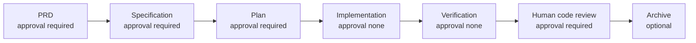

Aunque los workflows actuales son lineales, el motor no depende del orden fisico del YAML. Usa `requires` y ordenamiento topologico, por lo que el contrato puede evolucionar hacia grafos con ramas.

---

## 14. Maquina de estados

### 14.1. Estados de fase

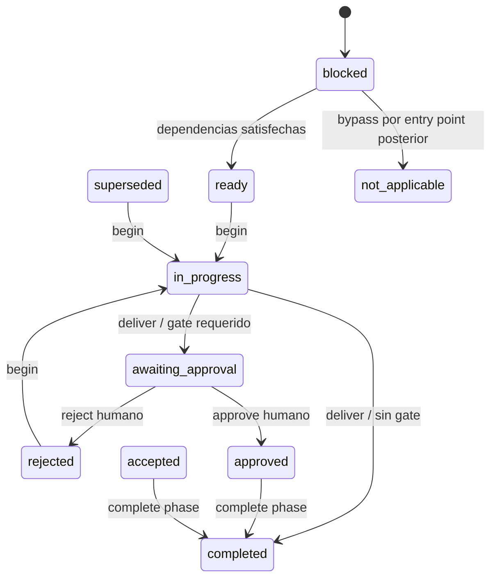

### 14.2. Estados de work item

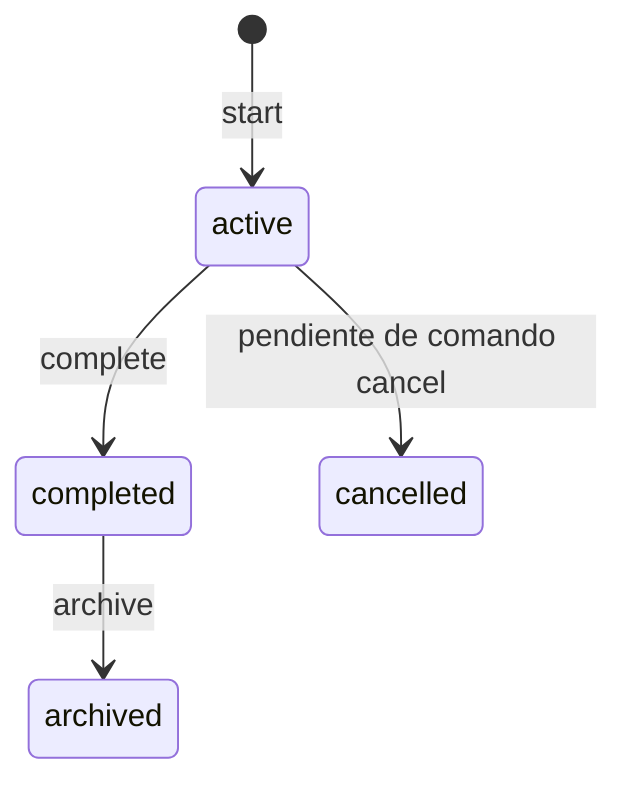

Actualmente la superficie publica implementa `active -> completed -> archived`. `cancelled` permanece sin comando.

### 14.3. Diferencia entre `approved` y `completed`

`approved` significa:

> Una persona acepto el contenido entregado.

`completed` significa:

> La fase termino y sus dependientes pueden considerarla satisfecha.

Por eso una fase con gate sigue:

```text
in_progress -> awaiting_approval -> approved -> completed
```

Una fase sin gate sigue:

```text
in_progress -> completed
```

---

## 15. Modelo de datos conceptual

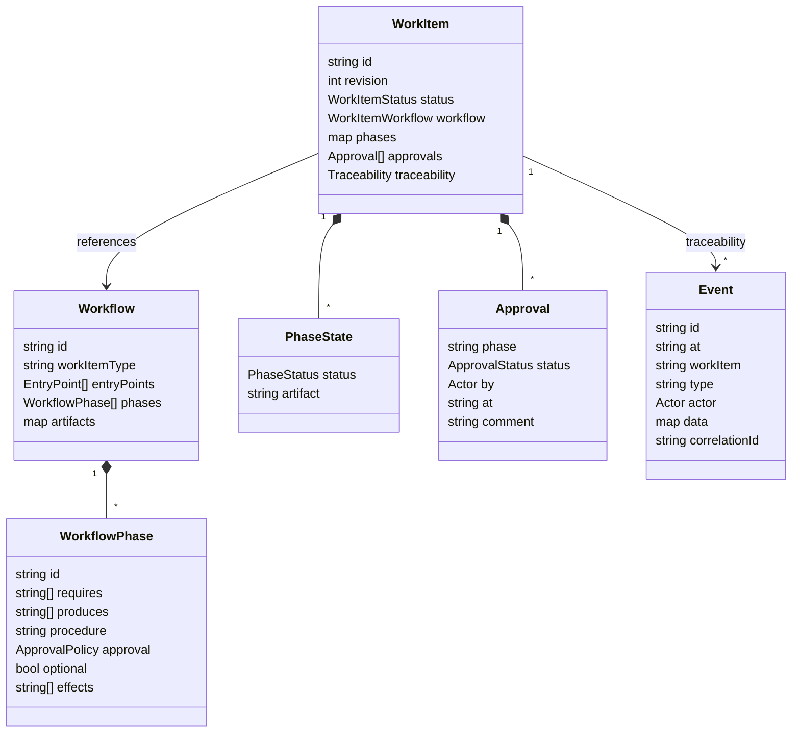

El `WorkItem` funciona como **aggregate root**: las mutaciones de fases y approvals se realizan a traves de sus metodos para preservar invariantes.

---

## 16. Flujo de datos general

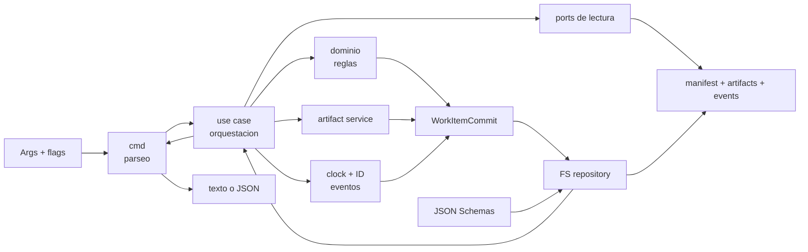

La unidad de persistencia no es un archivo aislado. Es:

```go
type WorkItemCommit struct {
    Item        *domain.WorkItem
    Artifacts   []ArtifactWrite
    Events      []domain.Event
    OperationID string
}
```

Esto mantiene juntos estado, documentos y auditoria.

---

## 17. Recorrido de codigo: arranque y composition root

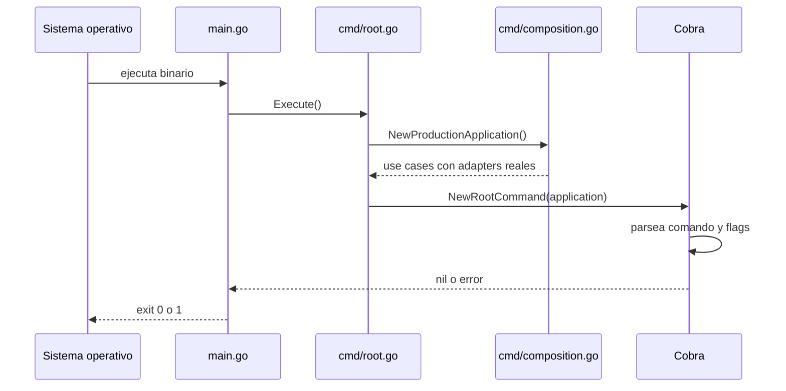

Este diseño mantiene `main.go` libre de logica y hace visible el wiring productivo en un solo archivo.

---

## 18. Recorrido de codigo: `sdd-cli start`

`start` es uno de los recorridos mas completos porque crea el agregado, resuelve configuracion, prepara artifacts y emite varios eventos.

### 18.1. Secuencia

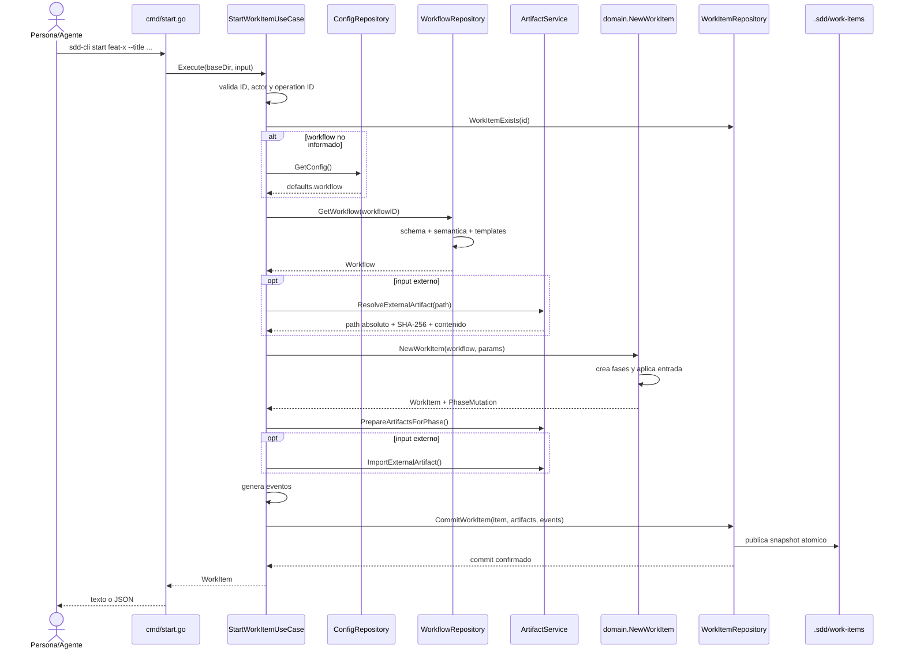

### 18.2. Que decide cada capa

| Decision | Capa |
| --- | --- |
| `--title` es requerido | `cmd` |
| ID y actor son validos | `domain` |
| Workflow default | `usecase` + `ConfigRepository` |
| Workflow es un DAG valido | `domain`/`infra` |
| Estados iniciales | `domain.NewWorkItem` |
| Template local a utilizar | `infra.ArtifactManager` |
| Eventos de creacion | `usecase` |
| Revision y atomicidad | `infra.FSWorkItemRepository` |

---

## 19. Recorrido de codigo: ciclo de una fase

El ciclo normal usa cuatro comandos:

```text
begin -> deliver -> approve -> complete
```

`approve` se omite para una fase sin gate. `complete phase` es una normalizacion explicita de `approved` o `accepted` a `completed`; no es necesaria para desbloquear dependencias ni para completar el work item.

Si el humano rechaza la entrega, la fase vuelve al circuito de trabajo:

```text
deliver -> reject -> begin -> deliver -> approve | reject
```

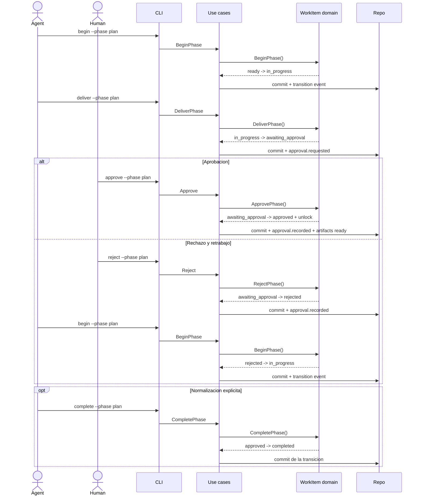

La preparacion del artifact de la siguiente fase sucede al aprobar o completar la dependencia que la desbloquea, no cuando se ejecuta `begin`.

---

## 20. Recorrido de codigo: consulta `next`

`next` demuestra la separacion entre consulta y comando.

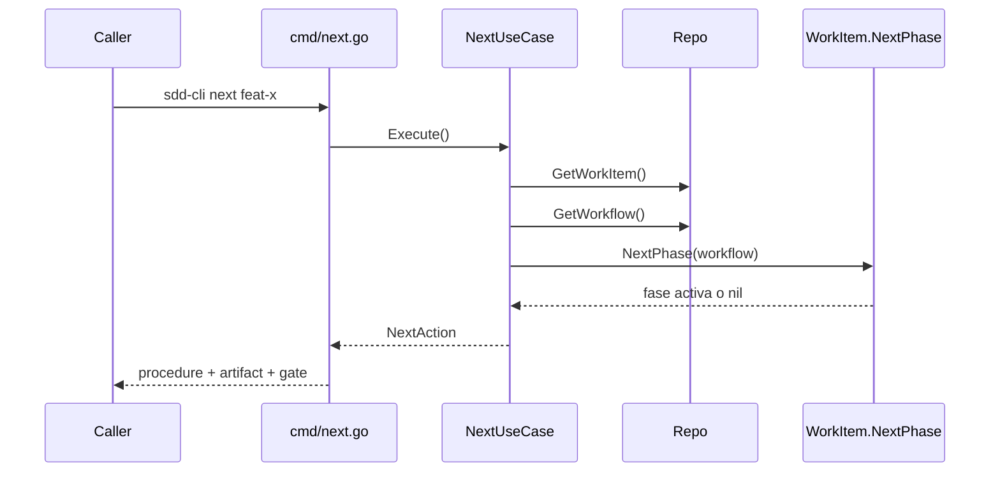

No existe llamada a `CommitWorkItem`, por lo que:

- no cambia fases;
- no escribe eventos;
- no aumenta `revision`;
- puede ejecutarse repetidamente sin efectos.

---

## 21. Persistencia transaccional

El filesystem no ofrece una transaccion multiarchivo nativa. La infraestructura construye una mediante snapshots y renames.

### 21.1. Algoritmo

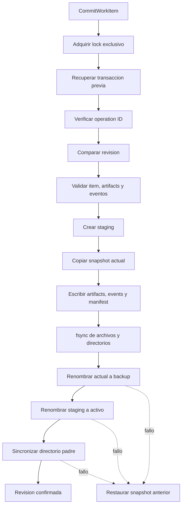

### 21.2. Garantias

- Un fallo antes de publicar no cambia el estado visible.
- Un fallo durante la publicacion intenta restaurar el snapshot anterior.
- Una operacion no puede confirmar manifest sin sus eventos o artifacts asociados.
- La siguiente lectura recupera un backup si detecta una interrupcion entre renames.
- Los symlinks y archivos no regulares no se copian dentro del snapshot.

### 21.3. Movimiento transaccional a archive

Archive utiliza paths internos independientes:

```text
.transactions/<id>.archive-stage/
.transactions/<id>.archive-backup/
.transactions/<id>.archive.json
```

El adapter construye y valida el snapshot final, retira `active/<id>` hacia el
backup y publica el stage directamente en `archive/YYYY-MM-DD-<id>`. La aparición
del destino válido es el punto de commit.

Recovery aplica una regla conservadora:

- destino ausente: restaura el backup a active;
- destino válido presente: conserva archive y limpia internos;
- active y archive simultáneos: reporta `archive_conflict` sin borrar evidencia.

### 21.4. Revision optimista

Cada manifest posee:

```yaml
revision: 7
```

El repositorio compara la revision leida con la revision persistida:

```text
esperada != actual -> concurrent_modification
```

En un commit exitoso:

```text
revision persistida = revision esperada + 1
```

---

## 22. Concurrencia

La politica v0.1 es:

```text
Multiples lectores.
Un solo escritor simultaneo por work item.
```

Cada mutacion intenta adquirir:

```text
.sdd/work-items/.locks/<work-item-id>.lock
```

Si otro proceso ya escribe el mismo item, la operacion falla con `work_item_locked`.

El lock evita escritores simultaneos y `revision` evita sobrescribir una version nueva usando un objeto obsoleto.

Dos work items diferentes pueden mutarse independientemente porque el lock es por ID, no global.

---

## 23. Idempotencia y `operation_id`

Un agente puede perder la respuesta de una operacion aunque la CLI haya confirmado el cambio. Repetir ciegamente el comando podria duplicar eventos o intentar una transicion ya aplicada.

El `operation_id` resuelve ese caso.

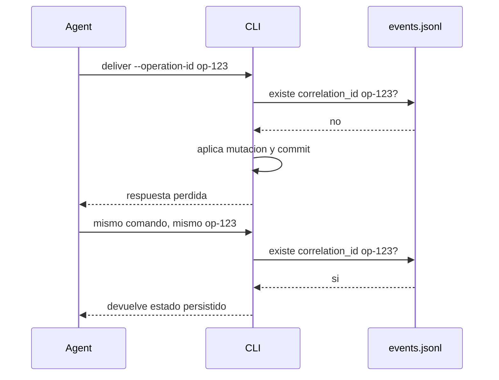

Propiedades:

- el mismo ID identifica el mismo intento logico;
- no duplica eventos;
- no vuelve a incrementar revision;
- no ejecuta dos veces la transicion;
- diferentes operaciones deben usar IDs diferentes.

Formato permitido:

```text
1 a 128 caracteres:
letras, numeros, punto, dos puntos, guion bajo y guion
```

Ejemplos:

```text
run:feat-x:plan:deliver:001
agent-session-42.approve.plan
```

---

## 24. Eventos y trazabilidad

Cada linea de `events.jsonl` es un JSON independiente.

```json
{
  "schema_version": "0.1",
  "id": "evt_4d3c...",
  "at": "2026-08-19T12:00:00Z",
  "work_item": "feat-add-coupons",
  "type": "phase.transitioned",
  "actor": {
    "kind": "agent",
    "id": "copilot"
  },
  "data": {
    "phase": "plan",
    "from": "in_progress",
    "to": "awaiting_approval",
    "cause": "phase_delivered"
  },
  "correlation_id": "run:plan:deliver:001"
}
```

### 24.1. Eventos generados por el motor

| Evento | Momento |
| --- | --- |
| `work_item.created` | Creacion del item |
| `phase.bypassed_by_external_input` | Inicio desde artifact externo |
| `phase.transitioned` | Toda transicion principal o derivada |
| `approval.requested` | Entrega que necesita gate |
| `approval.recorded` | Aprobacion o rechazo humano |
| `work_item.completed` | Cierre logico del item |
| Tipo custom | `record-event` |

### 24.2. Orden dentro de una operacion

Para una transicion normal:

1. evento principal de la operacion, si aplica;
2. transicion principal;
3. transiciones derivadas por desbloqueo.

Para input externo:

1. `work_item.created`;
2. `phase.bypassed_by_external_input`;
3. `phase.transitioned`.

### 24.3. IDs y tiempo

- `SystemClock` entrega UTC.
- `CryptoIDGenerator` genera 128 bits aleatorios.
- Los IDs comienzan con `evt_`.
- El timestamp no se usa como ID.

Reloj e IDs son ports inyectables para que los tests sean deterministas.

---

## 25. Validacion estructural y semantica

La CLI aplica dos niveles de validacion.

### 25.1. JSON Schema

| Schema | Protege |
| --- | --- |
| `workflow.schema.json` | Forma de workflows |
| `work-item.schema.json` | Forma de manifests |
| `artifact.schema.json` | Front matter de artifacts |
| `event.schema.json` | Forma de eventos |

### 25.2. Reglas semanticas

El schema no puede expresar todas las invariantes. `Workflow.ValidateSemantics` verifica ademas:

- IDs unicos y kebab-case;
- al menos una fase y un entry point;
- politicas de approval conocidas;
- exactamente un artifact por fase en v0.1;
- dependencias existentes;
- ausencia de auto-dependencias;
- ausencia de ciclos;
- artifacts producidos una unica vez;
- entry points no ambiguos;
- inputs externos compatibles;
- fases alcanzables;
- paths normalizados dentro de `artifacts/`;
- extension Markdown;
- templates existentes y validos.

`WorkItem.ValidateAgainst` verifica:

- workflow y version correctos;
- tipo compatible;
- entry point declarado;
- metadata de artifact externo;
- mismas fases que el workflow;
- paths de artifacts;
- uso valido de `not_applicable`;
- dependencias satisfechas;
- approvals compatibles;
- completitud real de un item `completed`.

### 25.3. Diagnostico explicito

`sdd validate` reutiliza estas invariantes, pero no se detiene en el primer error.
Los validadores de dominio exponen colecciones de violaciones y conservan sus
wrappers fail-fast para las operaciones existentes.

El inspector agrega checks sobre:

- config consumida por la CLI;
- compilacion de los cuatro schemas;
- todos los workflows dentro del scope;
- templates, placeholders y procedures;
- manifests y approvals;
- artifacts persistidos y su front matter;
- lineas, IDs y continuidad basica de `events.jsonl`;
- hashes externos disponibles;
- baseline specs y related work item IDs.

No compara todavía el `status` del front matter con el estado de fase: las
transiciones actuales no sincronizan esa metadata. Tampoco valida expedientes
archivados hasta implementar el movimiento fisico.

---

## 26. Seguridad de paths

La CLI opera sobre paths controlados por IDs y YAML, por lo que protege:

- traversal mediante `../`;
- paths absolutos en ubicaciones internas donde no estan permitidos;
- paths no normalizados;
- artifacts fuera de `artifacts/`;
- symlinks que escapan del root;
- archivos no regulares dentro del snapshot.

La excepcion intencional es `--from-artifact`: puede apuntar a un archivo externo al proyecto. La CLI resuelve y registra su path absoluto, pero nunca lo utiliza como destino de escritura.

Los IDs usan:

```text
^[a-z0-9]+(?:-[a-z0-9]+)*$
```

Ejemplos validos:

```text
feat-add-coupons
bug-123
fast-change
```

Ejemplos invalidos:

```text
../outside
Feature_A
feat/add
```

`containedPath` valida tanto el path textual como los componentes existentes resueltos mediante symlinks.

---

## 27. Artifacts y templates locales

Los recursos embebidos se usan solamente para instalar `.sdd/`.

Durante la ejecucion normal, `ArtifactManager` lee:

```text
<proyecto>/.sdd/templates/<template>.md
```

Esto permite personalizar templates por proyecto sin recompilar la CLI.

### 27.1. Preparacion

Para cada artifact:

1. obtiene la configuracion desde el workflow;
2. lee el template local;
3. reemplaza placeholders;
4. verifica que no queden `{{...}}`;
5. extrae front matter;
6. valida `artifact.schema.json`;
7. verifica `id`, `phase` y `work_item`;
8. devuelve un `ArtifactWrite` aun no persistido.

La escritura real ocurre luego dentro del commit transaccional.

### 27.2. Input externo

La CLI conserva el front matter canonico generado por el motor y reemplaza el cuerpo con el contenido importado.

Ademas registra en el manifest:

```yaml
input:
  source: external_artifact
  external_artifact:
    artifact: plan
    path: /ruta/absoluta/plan.md
    sha256: ...
```

---

## 28. Contrato de salida

### 28.1. Modo humano

Sin `--json`, los exitos se imprimen en stdout y los errores en stderr.

Ejemplo:

```text
Phase 'plan' delivered for work item 'feat-add-coupons'.
```

### 28.2. Modo agente

Con `--json`, stdout contiene un unico envelope:

```json
{
  "success": true,
  "data": {}
}
```

Error:

```json
{
  "success": false,
  "error": {
    "code": "validation_failed",
    "message": "validation found 2 error(s)",
    "details": {
      "scope": "work_item",
      "target": "feat-add-coupons",
      "valid": false,
      "summary": {"total": 20, "passed": 18, "warnings": 0, "failed": 2},
      "checks": []
    }
  }
}
```

### 28.3. Codigos de error

| Codigo | Significado |
| --- | --- |
| `invalid_arguments` | Args, flags o comando incorrectos |
| `invalid_input` | ID, actor, path, schema o contrato invalido |
| `not_found` | Work item, workflow o fase inexistente |
| `already_exists` | Colision al crear |
| `invalid_transition` | Operacion no permitida por el estado |
| `validation_failed` | El diagnostico se ejecuto y encontro inconsistencias |
| `concurrent_modification` | Revision obsoleta |
| `work_item_locked` | Otro escritor posee el lock |
| `internal_error` | Error no clasificado |

El proceso devuelve:

- exit code `0` en exito;
- exit code `1` en error.

---

## 29. DFD del motor

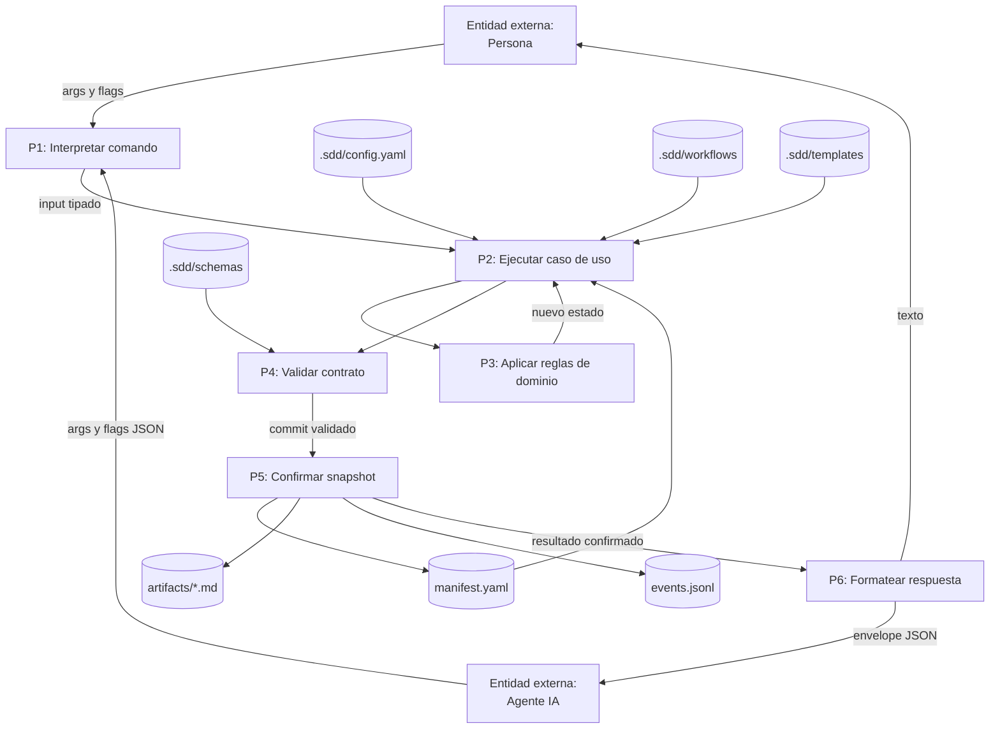

---

## 30. Suite de tests y garantias

La suite esta organizada por propiedades contractuales, no solo por funciones.

| Grupo | Que demuestra |
| --- | --- |
| Dominio table-driven | Estados validos e invalidos |
| Workflow validation | DAG, entry points, dependencies y paths |
| Schema fixtures | Casos validos fallan si dejan de ser validos e invalidos son rechazados |
| Persistencia | Atomicidad, rollback, recuperacion, locks y revision |
| Idempotencia | Reintentos no duplican operaciones |
| Dependency injection | Fallos de ports se propagan sin commits falsos |
| Contract integration | Templates locales, config, artifacts externos y seguridad |
| Validation inspector | Diagnostico acumulativo, orden estable y ausencia de recuperacion/escrituras |
| Workflow lifecycle | Todos los workflows completan su recorrido obligatorio |
| CLI E2E | Binario real, stdout, stderr, JSON y exit codes |

Tests destacados:

- `TestEveryWorkflowCompletesItsMandatoryLifecycle`;
- `TestCLICompletesFastChangeLifecycle`;
- `TestCLIValidateReportsMultipleFailuresWithoutMutation`;
- `TestValidationInspectorDoesNotRecoverTransactions`;
- `TestFullWorkItemLifecycle`;
- `TestBypassModeStart`;
- matrices de `BeginPhase`, `DeliverPhase` y `CompletePhase`;
- fallos antes y durante publicacion;
- writers concurrentes y revisiones obsoletas.

La prueba de lifecycle descubre automaticamente todos los `*.workflow.yaml`. Agregar un workflow nuevo lo incorpora a la obligacion contractual sin mantener una lista duplicada.

---

## 31. Como desarrollar y ejecutar la CLI

### 31.1. Preparar recursos y compilar

```bash
cd src/cli
go generate ./...
go build -o sdd-cli .
```

No commitear:

```text
src/cli/sdd-cli
src/cli/embeds/default_sdd/
```

### 31.2. Instalación global en el sistema

Para utilizar la CLI de forma global (escribiendo simplemente `sdd-cli` desde cualquier directorio de tu terminal), sigue estos pasos:

1. **Configurar el PATH**: Asegúrate de tener el directorio binario de Go en tu variable de entorno. En macOS/Zsh, añade la siguiente línea a tu archivo `~/.zshrc` (si no existe el archivo, créalo con `touch ~/.zshrc`):
   ```bash
   export PATH=$PATH:$(go env GOPATH)/bin
   ```
   Aplica los cambios en tu sesión actual:
   ```bash
   source ~/.zshrc
   ```

2. **Compilar e instalar**: Ejecuta los siguientes comandos desde la carpeta `src/cli/` del proyecto:
   ```bash
   go generate ./...
   go install
   ```

El binario compilado quedará instalado bajo el nombre nativo `sdd-cli` directamente en tu `$GOPATH/bin`, listo para ser ejecutado desde cualquier ubicación.

### 31.3. Ejecutar tests

```bash
cd src/cli
go test ./...
go test -race ./...
go vet ./...
```

### 31.4. Formato

```bash
gofmt -w .
```

`gofmt` es el formateador canonico de Go. No se discute estilo de espacios o llaves como en otros ecosistemas: el toolchain impone el formato.

### 31.5. Probar contra otro proyecto

```bash
./sdd-cli init --dir /tmp/my-project

./sdd-cli start feat-example \
  --dir /tmp/my-project \
  --title "Ejemplo"

./sdd-cli status feat-example \
  --dir /tmp/my-project
```

---

## 32. Ejemplo completo: `fast-change`

```bash
SDD=./sdd-cli
PROJECT=/tmp/example-project

$SDD init --dir "$PROJECT"

$SDD start fast-update-copy \
  --dir "$PROJECT" \
  --workflow fast-change \
  --title "Actualizar copy de checkout" \
  --summary "Corregir mensaje de validacion" \
  --operation-id run:start:001

# `plan` comienza automaticamente in_progress al crear el item.
$SDD deliver fast-update-copy \
  --dir "$PROJECT" \
  --phase plan \
  --operation-id run:plan:deliver:001

$SDD approve fast-update-copy \
  --dir "$PROJECT" \
  --phase plan \
  --by matias \
  --operation-id run:plan:approve:001

$SDD complete fast-update-copy \
  --dir "$PROJECT" \
  --phase plan \
  --operation-id run:plan:complete:001

$SDD begin fast-update-copy \
  --dir "$PROJECT" \
  --phase implementation \
  --actor-id copilot \
  --operation-id run:implementation:begin:001

$SDD deliver fast-update-copy \
  --dir "$PROJECT" \
  --phase implementation \
  --actor-id copilot \
  --operation-id run:implementation:deliver:001

# Repetir begin/deliver para verification.
# Human code review requiere deliver -> approve.
# complete --phase es opcional para normalizar approved -> completed.

$SDD complete fast-update-copy \
  --dir "$PROJECT" \
  --operation-id run:work-item:complete:001
```

La CLI gobierna estados y evidencia. El contenido del plan, implementacion y verificacion debe producirlo el agente siguiendo el `procedure` indicado.

---

## 33. Decisiones arquitectonicas relevantes

### 33.1. Workflows como datos

Agregar o modificar un workflow debe hacerse en YAML. La maquina no contiene un `switch` por tipo de feature o bug.

### 33.2. Dominio rico

Las invariantes viven en metodos de `WorkItem` y `Workflow`, no dispersas entre comandos.

### 33.3. Ports pequenos

No existe una interfaz gigante por conveniencia. Cada use case depende de las capacidades que necesita.

### 33.4. Commit conjunto

Manifest, artifacts y eventos no son stores independientes desde la perspectiva de una mutacion. Forman una unica unidad de consistencia.

### 33.5. Consultas puras

`status`, `next` y `validate` no mutan estado. `validate` tampoco recupera transacciones interrumpidas: diagnostica el snapshot visible. La accion explicita se realiza con `begin`, `deliver`, `approve`, `reject`, `complete` o `archive`.

### 33.6. Contrato local

Luego de `init`, el proyecto controla sus workflows y templates locales. El binario no impone silenciosamente la copia original.

---

## 34. Limites actuales y roadmap

### 34.1. Pendiente de alta prioridad

| Capacidad | Alcance propuesto |
| --- | --- |
| **Retrabajo semántico e invalidación transitoria** | Diseñar una operación explícita, propuesta como `sdd-cli rework <id> --phase <id> --reason ...`. Debe reabrir la fase que requiere corrección, marcar `superseded` únicamente a sus descendientes afectados en el DAG, preservar artifacts y approvals como historial, registrar las transiciones y bloquear el avance hasta completar nuevamente la cadena. Si el work item estaba `completed`, debe volver a `active`; un expediente `archived` no se reabre y debe originar un work item nuevo vinculado. |
| **Cancelación explícita** | Diseñar `sdd-cli cancel <id> --reason ...` con actor autorizado, motivo obligatorio, evento de auditoría e invariantes de cierre. Debe decidirse expresamente la ubicación física de un work item cancelado y su relación con archive; no se debe reutilizar `archived` como sustituto de `cancelled`. |
| **Primer adapter de agente** | Implementar un adapter inicial para Claude Code o GitHub Copilot. Debe aportar instrucciones, skills y hooks para consultar `status`/`next` e invocar comandos SDD, pero nunca duplicar la máquina de estados ni mutar manifests directamente. |
| **Pruebas reales del harness** | Ejecutar un workflow completo sobre un proyecto real usando el adapter elegido, para comprobar ergonomía, contexto entregado al agente, recuperabilidad e intervención humana en gates. |

### 34.2. Capacidades de motor posteriores

| Capacidad | Alcance propuesto |
| --- | --- |
| **Consolidación de baseline specs y changelog** | Convertir la evidencia de `archive.md` en una operación guiada o autorizada que consolide deltas de especificación. No debe intentar merges semánticos automáticos sin revisión. |
| **Autorización de efectos externos** | Modelar políticas y eventos para commit, push, PR, tickets, despliegues o escritura de changelog. El workflow sólo declara efectos potenciales; un adapter/policy debe autorizar cada efecto de forma explícita. |
| **MCPs y política de herramientas** | Crear un catálogo portable de MCPs/herramientas permitidas por proyecto, fase y agente. Debe declarar permisos, límites y evidencia requerida, sin acoplar el contrato central a un proveedor específico. |
| **Observabilidad de tokens y costos** | Normalizar en eventos el proveedor, modelo, tokens de input/output/cache, duración y costo cuando estén disponibles; generar agregados opcionales sin registrar secretos ni prompts completos. |

### 34.3. Evolución del ecosistema

- adapters específicos para otros agentes, reutilizando el mismo contrato;
- catálogo de skills y permisos por plataforma;
- memoria episódica/semántica con Engram;
- navegación y recuperación de relaciones de código con CodeGraph;
- integraciones con GitHub, Azure DevOps u otros proveedores;
- presupuestos, límites y reportes avanzados de consumo;
- índices de búsqueda de expedientes y conocimiento consolidado.

El orden no es accidental: primero hay que cerrar las reglas de retrabajo y
cancelación del motor; después validar un adapter con uso real; recién entonces
conviene invertir en integraciones, memoria o automatización adicional.

---

## 35. Guia de lectura para incorporarse al proyecto

Orden recomendado:

1. Este documento para comprender el sistema completo.
2. `src/.sdd/workflows/` para ver los procesos reales.
3. `internal/domain/work_item.go` para la maquina de estados.
4. `internal/domain/workflow_validation.go` para las reglas del grafo.
5. `internal/ports/repository.go` para las fronteras.
6. `internal/usecases/start_uc.go` y un use case de transicion.
7. `cmd/composition.go` para ver el wiring.
8. `internal/infra/fs_repository.go` para persistencia.
9. `cmd/cli_e2e_test.go` para observar el comportamiento externo.
10. `internal/usecases/workflow_lifecycle_test.go` para entender la garantia global.

No conviene comenzar por `fs_repository.go`: es el archivo mas largo y contiene detalles mecanicos que se entienden mejor despues de conocer dominio y ports.

---

## 36. Checklist para agregar una capacidad

Antes de implementar un comando nuevo:

1. Definir la regla en el contrato.
2. Verificar si pertenece al dominio o solo a un adapter.
3. Modelar la invariante dentro de `domain`.
4. Definir el port minimo si requiere una capacidad externa.
5. Implementar el use case sin importar `infra`.
6. Conectar dependencias en `cmd/composition.go`.
7. Crear el comando Cobra solo como adapter.
8. Emitir eventos contractuales.
9. Confirmar mediante `WorkItemCommit`.
10. Agregar tests de exito, estados invalidos, fallos de ports y CLI.
11. Actualizar este documento si cambia la superficie publica.

---

## 37. Glosario rapido para desarrolladores

| Termino Go/proyecto | Lectura practica |
| --- | --- |
| Receiver | Objeto sobre el que se ejecuta un metodo |
| Pointer `*T` | Referencia mutable a una instancia |
| Port | Interface requerida por la aplicacion |
| Adapter | Implementacion concreta de un port |
| Composition root | Lugar donde se conectan implementaciones |
| Aggregate root | Entidad que protege las invariantes del conjunto |
| Table-driven test | Matriz de casos recorrida por un test |
| Snapshot | Copia completa y consistente del work item |
| Optimistic concurrency | Rechazar escritura si la version cambio |
| Idempotencia | Repetir la misma operacion logica sin duplicar efectos |
| JSONL | Un objeto JSON por linea |
| Front matter | Metadata YAML al inicio de un Markdown |
| DAG | Grafo dirigido sin ciclos |

---

## 38. Preguntas frecuentes (FAQ)

### 38.1. ¿Qué es un DAG y qué rol cumple en este proyecto?
* **Concepto:** Un Grafo Acíclico Dirigido (DAG) es una estructura de datos jerárquica de nodos conectados por aristas con dirección donde no existen bucles ni ciclos (es imposible volver al punto de partida siguiendo las flechas).
* **Rol en el proyecto:** Las fases de un workflow de desarrollo se modelan y validan como un DAG, donde los nodos son las fases y las dependencias (`requires`) son las aristas. Esto le permite al motor:
  1. Validar semánticamente que no existan dependencias circulares (ej. A requiere B y B requiere A).
  2. Determinar de manera dinámica qué fases están listas (`ready`) para ejecutarse en base a qué dependencias previas ya fueron satisfechas.
  3. Soportar en el futuro workflows no lineales con ramas paralelas de ejecución.

### 38.2. ¿Qué es el estado `superseded`? ¿Cómo se adopta y en qué momento?
* **Concepto:** Es el estado que indica que el contenido o artefacto producido por una fase ya no es válido ("superado") porque una de las fases previas que servían de insumo fue modificada.
* **Casuística:** Si a mitad de la fase de `implementation` necesitas corregir algo del diseño y vuelves atrás a modificar el `plan`, la fase de implementación y sus sucesoras en el grafo quedan desactualizadas. En ese momento, deberían pasar a estar `superseded`.
* **Estado actual:** El dominio soporta la constante `PhaseSuperseded` y permite la transición de vuelta a progreso (`superseded -> in_progress` usando `sdd-cli begin`). Sin embargo, en la versión v0.1 actual, el motor no realiza transiciones automáticas a `superseded` hacia atrás por comandos. Hoy en día, forzar este estado requiere la edición manual del `manifest.yaml` o intervención del orquestador.

### 38.3. ¿Qué es el ordenamiento topológico y para qué se usa?
* **Concepto:** Es un algoritmo para ordenar linealmente los nodos de un DAG de manera que para cualquier dependencia `A -> B`, el nodo `A` aparezca siempre antes que `B` en la lista resultante.
* **Uso en el proyecto:** Se implementa mediante el método `OrderedPhases` (usando el algoritmo de Kahn) y se usa para:
  1. **Visualización:** Ordenar las fases topológicamente al ejecutar `sdd-cli status`, ya que en el manifest YAML se guardan como un mapa sin orden garantizado.
  2. **Orquestación:** Evaluar y priorizar cuál es la fase siguiente a ejecutar al invocar `sdd-cli next`.

### 38.4. ¿Qué ocurre con la completitud de fases si quiero volver atrás?
* **Comportamiento:** La CLI actual está diseñada para ser lineal y progresiva. No existe un comando público (como `sdd-cli rollback`) para "descompletar" fases ya finalizadas.
* **Resolución:** Si necesitas retroceder a una fase anterior para corregirla, en la v0.1 debes:
  1. Modificar manualmente el archivo `manifest.yaml` para revertir el estado de la fase (ej: a `in_progress` o `superseded`).
  2. O bien, utilizar el control de versiones de Git (`git checkout` o revertir cambios locales no commiteados) para restaurar el manifest a un punto anterior.

### 38.5. ¿Qué ocurre si intento volver atrás en un work item `completed` o `archived`?
* **Comportamiento:** El dominio de la CLI bloquea de forma estricta cualquier cambio de fase si el estado general del work item es `completed` o `archived` (excepto para fases marcadas como opcionales en el workflow).
* **Resolución:** Para forzar una modificación o retroceso, es necesario editar a mano el archivo `manifest.yaml` para cambiar el estado general del work item de vuelta a `active` y ajustar las fases correspondientes, o bien revertir los archivos mediante Git.

### 38.6. ¿Qué es el `WorkItemCommit` y qué función cumple?
* **Concepto:** Es la estructura intermedia que agrupa el `WorkItem` (estado general), los `Artifacts` (archivos Markdown generados) y los `Events` (historial de auditoría), junto con el `operation_id`.
* **Función:** Actúa como la **unidad transaccional de persistencia**. El repositorio de infraestructura la utiliza para garantizar la atomicidad en el filesystem ("todo o nada"), asegurando que nunca quede el manifest modificado si los eventos o artefactos correspondientes no pudieron guardarse físicamente en el disco.

### 38.7. ¿Para qué se usa Path Absoluto + SHA-256?
* **Uso:** Al inicializar un work item desde un artefacto externo con la flag `--from-artifact`.
* **Propósito:**
  * El **Path Absoluto** identifica de forma unívoca la ubicación del archivo de origen en el disco.
  * El **SHA-256** congela una huella digital inmutable de su contenido. Si el archivo se modifica externamente en el futuro, el hash no coincidirá, sirviendo como auditoría e integridad de que el flujo se inició exactamente con esa especificación.

### 38.8. ¿Qué es la persistencia transaccional y cómo funciona el algoritmo?
* **Concepto:** Es simular la atomicidad transaccional de una base de datos directamente sobre el filesystem del sistema operativo.
* **Algoritmo paso a paso:**
  1. **Lock**: Se toma un bloqueo exclusivo sobre el archivo `.locks/<id>.lock`.
  2. **Recovery**: Se limpia cualquier residuo de transacciones previas interrumpidas.
  3. **Checks**: Se verifica la idempotencia (`operation_id`) y la revisión optimista.
  4. **Staging**: Se crea un directorio temporal `.tmp` y se copia el snapshot completo del item actual.
  5. **Write**: Se escriben los nuevos datos, artifacts y eventos al `.tmp`.
  6. **Fsync**: Se fuerza la escritura física de todos los archivos y carpetas en disco.
  7. **Rename Backup**: El directorio activo se renombra a `.bak`.
  8. **Rename Publish**: El directorio de staging `.tmp` se renombra al path activo.
  9. **Dir Fsync**: Sincroniza el directorio padre.
  10. **Clean**: Se borra la carpeta `.bak`.
  * *Si hay fallos de renombrado o fsync, el sistema revierte el backup `.bak` a su ubicación original.*

### 38.9. Concurrencia: ¿Cómo funciona el mecanismo de locks y cómo convive con la revisión?
El sistema gestiona la concurrencia a través de dos capas que operan en niveles diferentes (bloqueo físico del sistema operativo + concurrencia optimista lógica de datos):
* **Locks de Archivo (Concurrencia Pesimista):** Usa bloqueos a nivel de archivo con `flock` (o equivalente en Windows) mediante la librería de Go. Cuando un proceso mutador se ejecuta, toma un lock exclusivo en `.locks/<id>.lock`. Si otro proceso intenta mutar el mismo item concurrentemente, no puede adquirir el lock de archivo y falla de inmediato con `work_item_locked`. Esto previene colisiones y corrupción a nivel físico de filesystem mientras dura la transacción (milisegundos).
* **Número de Revisión (Concurrencia Optimista):** El manifest guarda un entero `revision`. Cuando la CLI lee el manifest (revisión `N`) y va a confirmar cambios, el commit requiere que la versión en disco siga siendo `N`. Si otro proceso modificó el item antes (llevando el disco a `N+1`), el commit fallará con `concurrent_modification`.
* **Convivencia:** El lock de archivo protege que dos comandos concurrentes no rompan físicamente la secuencia de staging/rename en el disco al mismo tiempo. El número de revisión protege el negocio a largo plazo (evita que un agente sobrescriba las decisiones que otro agente o humano tomó segundos o minutos atrás mientras el primero aún preparaba su entrega).

### 38.10. ¿La idempotencia por `operation_id` es lo mismo que ejecutar `sdd-cli status`?
No. Aunque la salida del reintento exitoso se parezca a una consulta:
* `status` es una consulta **lectura pura (Read-Only)** que no sabe la intención del agente y no valida nada.
* El reintento idempotente (enviando el mismo comando mutador con el mismo `operation_id`) es un **intento de mutación**. La primera vez que se ejecuta, el motor aplica la lógica de la fase (altera estados, escribe templates y registra eventos). En el reintento (por ejemplo, si el agente perdió la conexión de red original y no sabe si el comando impactó), el motor busca el ID en el log de eventos y, al ver que ya se aplicó, **no vuelve a modificar el disco ni a incrementar revisiones**, pero le devuelve al agente el resultado exitoso original. Esto evita que el agente tenga que correr un `status` y deducir o parsear si su acción fue exitosa, eliminando "alucinaciones de estado".

### 38.11. ¿Cómo se conocen y utilizan los comandos disponibles en el proyecto y en Go?
* **En la CLI del proyecto (`sdd-cli`):** Al construirse sobre la librería Cobra, la CLI es autodescriptiva. Puedes ejecutar `sdd-cli --help` (o simplemente `sdd-cli` sin argumentos) para desplegar el menú principal con todos los comandos (`init`, `start`, `status`, `next`, `begin`, `deliver`, `approve`, `complete`, etc.) y sus respectivas flags.
* **En el toolkit nativo de Go (toolchain):** Durante el desarrollo se utilizan los siguientes comandos principales:
  * `go build`: Compila el código del proyecto y genera el binario ejecutable final (`sdd-cli`).
  * `go run <archivo>`: Compila en memoria y ejecuta el programa directamente, agilizando las pruebas rápidas en desarrollo (ej. `go run main.go`).
  * `go test ./...`: Ejecuta la suite completa de pruebas unitarias y de integración del proyecto.
  * `go generate ./...`: Escanea el código en busca de directivas especiales (`//go:generate`) para ejecutar scripts automáticos previos a la compilación.
  * `go fmt ./...`: Formatea todo el código del repositorio siguiendo las convenciones de estilo oficiales de Go.

### 38.12. ¿Cuál es la diferencia entre Struct, map[] y type en Go?
* **`struct`**: Es una estructura estática, inmutable en su forma y de tipado fuerte en tiempo de compilación. Agrupa campos fijos que pueden ser de distintos tipos (ej. strings, ints, booleanos u otros structs). Es el equivalente a las `interface` de TypeScript o a un DTO en Java.
* **`map[K]V`**: Es una estructura dinámica de clave-valor (similar a un `HashMap` en Java o a un objeto de JS `{}`). Al contrario del struct, todas las claves deben tener el mismo tipo `K` y todos los valores el mismo tipo `V`. Su tamaño y claves varían dinámicamente en tiempo de ejecución.
* **`type`**: Es una palabra clave reservada de Go para definir tipos de datos creados por el desarrollador. Se usa para declarar interfaces (`type Reader interface`), structs (`type WorkItem struct`), firmas de funciones o aliases de tipos básicos (`type State string`) con el fin de reforzar el sistema de tipos del compilador.

### 38.13. ¿Qué significan en Go "*" y "&" (Punteros vs Valores)?
En Go, todos los argumentos se pasan por **valor** (copiándolos en memoria) salvo que se indique lo contrario usando punteros:
* **El carácter `*`:**
  * **En la declaración de un tipo (ej. `*WorkItem`):** Define un puntero, es decir, una variable que no almacena el objeto en sí sino su dirección de memoria física. Si una función recibe un puntero, puede mutar el objeto original en lugar de una copia.
  * **Como operador (ej. `*item`):** Realiza una desreferenciación. Sirve para acceder o modificar el valor guardado en la dirección de memoria a la que apunta el puntero.
* **El carácter `&`:** Es el operador que devuelve la dirección de memoria de una variable. Se usa para transformar una variable de valor en un puntero. Por ejemplo, `item := &WorkItem{}` crea un struct e inicializa `item` con su referencia de memoria.

### 38.14. ¿Qué significan "nil" y el operador ":=" en Go?
* **`nil`**: Representa la ausencia de valor o el valor cero para tipos de referencia (punteros, interfaces, maps, slices, funciones y canales). Es la analogía directa de `null` en Java o `null/undefined` en JavaScript.
* **El operador `:=`**: Es la declaración y asignación corta. Permite crear una variable nueva y asignarle un valor dentro de una función sin necesidad de escribir la palabra clave `var` ni definir explícitamente el tipo de dato, ya que Go lo deduce a partir del valor de la derecha (ej. `num := 10` se infiere como un entero). Para reasignaciones de variables ya existentes se utiliza el operador de asignación normal `=`.

### 38.15. ¿Qué es go:embed y //go:generate? ¿Qué ventajas, desventajas y analogías tienen?
Ambos se consideran **directivas del compilador**, es decir, comentarios especiales en el código fuente que el compilador de Go procesa activamente:
* **`go:embed`**:
  * **Función:** Inserta archivos o carpetas completas del sistema de archivos local directamente dentro del binario compilado. Esto nos permite distribuir la CLI de forma totalmente autónoma (la carpeta base `.sdd/` se empaqueta en el binario y se extrae localmente al correr `sdd-cli init`).
  * **Desventajas:** Aumenta el peso final del binario compilado y el consumo de memoria al cargarse. Adicionalmente, cualquier cambio en los recursos embebidos requiere recompilar el código de Go para que se aplique.
* **`//go:generate`**:
  * **Función:** Define una tarea o script que se ejecutará de forma automática al invocar el comando de terminal `go generate ./...` (por ejemplo, para regenerar código o sincronizar assets).
  * **Analogía con NodeJS:** Se comporta de forma similar a los `scripts` definidos en un `package.json`, con la diferencia de que en Go las tareas se declaran de manera distribuida dentro del código fuente en lugar de un archivo de configuración centralizado. Además, se beneficia de estar integrado de forma nativa en el toolchain del lenguaje sin requerir librerías externas de scripting.

---

## 39. Conclusiones

La CLI actual ya no es solamente un prototipo de comandos. Es un nucleo determinista con:

- workflows declarativos;
- maquina de estados centralizada;
- gates humanos;
- entrada desde artifacts externos;
- validacion por schema y semantica;
- paths contenidos;
- artifacts locales personalizables;
- eventos ordenados y correlacionados;
- commits multiarchivo controlados;
- locks, revision e idempotencia;
- output estable para personas y agentes;
- una suite contractual que recorre todos los workflows.

Su siguiente desafio no es endurecer nuevamente el mismo nucleo, sino completar la superficie publica pendiente e integrarla con el orquestador sin romper la frontera fundamental:

```text
El agente realiza el trabajo.
La CLI gobierna el proceso.
El contrato define las reglas.
Git conserva la evidencia.
```
