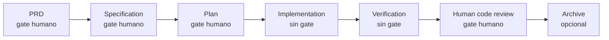

# El workflow de SDD

> Estado: **BETA**.
> Audiencia: cualquier persona que quiera entender cómo trabaja el framework SDD.
> Alcance: escenarios modelados, fases, gates, artefactos y fuentes de verdad.

Este documento explica **cómo piensa** el framework: qué procesos modela, qué pasos
tiene cada uno, qué produce y dónde vive la verdad del trabajo. Para la referencia
concreta de comandos, ver [CLI.md](./CLI.md).

---

## 1. Idea central

SDD (Spec-Driven Development) separa dos responsabilidades que normalmente se mezclan
cuando se trabaja con agentes de IA:

```text
Agente o persona: realiza el trabajo cognitivo (redacta, investiga, programa).
CLI (sdd-cli):    gobierna el proceso (valida reglas, cambia estado, registra evidencia).
```

El motor **no** escribe el PRD, no programa la feature ni decide qué modelo usar.
Su trabajo es gobernar: crear instancias de trabajo, conocer en qué fase están, validar
transiciones, impedir saltos no permitidos, exigir aprobaciones humanas, preparar los
artefactos de cada fase y registrar todo lo que pasa. Así el estado del proceso no
depende de que un LLM "recuerde" correctamente en qué punto estaba.

---

## 2. Conceptos

| Concepto | Significado |
| --- | --- |
| **Workflow** | Plantilla declarativa de un proceso: sus fases, dependencias, artefactos y gates. |
| **Work item** | Una instancia concreta de un workflow (una feature, un bug, un cambio). |
| **Fase** | Una unidad de trabajo dentro de un workflow, gobernada por estados. |
| **Artefacto** | Documento Markdown que produce una fase como evidencia (`artifacts/plan.md`). |
| **Gate** | Punto de aprobación humana obligatoria antes de continuar (Human In The Loop). |
| **Entry point** | Fase desde la cual el workflow permite empezar. |
| **Procedure** | Instrucción portable (skill) que guía *cómo* hacer el trabajo de una fase. |

---

## 3. Las tres fuentes de verdad de un work item

Cada work item vive en el filesystem, dentro de `.sdd/work-items/`, y su verdad se
reparte en tres archivos con roles distintos:

```text
.sdd/work-items/active/<id>/
├── manifest.yaml     -> ¿en qué estado está AHORA?
├── artifacts/*.md    -> ¿qué produjo cada fase?
└── events.jsonl      -> ¿cómo llegó hasta este estado?
```

- El **manifest** (`manifest.yaml`) es el estado actual: fases, aprobaciones, revisión.
- Los **artefactos** (`artifacts/`) son la evidencia legible: PRD, plan, reporte, etc.
- Los **eventos** (`events.jsonl`) son el historial inmutable, append-only.

El estado **no** se deduce leyendo el chat ni buscando checkboxes dentro del Markdown:
se lee del manifest. Git conserva todo esto versionado, y sigue siendo la fuente de
verdad última del repositorio.

---

## 4. Fases y su ciclo de vida

Toda fase avanza por una máquina de estados. El ciclo típico usa cuatro comandos:

```text
begin -> deliver -> approve -> complete
```

- `begin`: la fase pasa a `in_progress`; el agente empieza a trabajar.
- `deliver`: el agente entrega el resultado. Según el gate:
  - con gate requerido -> `awaiting_approval` (espera aprobación humana);
  - sin gate -> `completed` directamente.
- `approve` / `reject`: **solo un humano** puede aprobar o rechazar una fase con gate.
- `complete`: normaliza una fase `approved`/`accepted` a `completed`.

Estados de una fase:

```text
blocked -> ready -> in_progress -> awaiting_approval -> approved -> completed
                                 \-> completed (si no tiene gate)
awaiting_approval -> rejected -> in_progress (retrabajo)
```

Un rechazo no borra el trabajo anterior: se reabre la fase con `begin` y la nueva
entrega crea otra iteración de aprobación, conservando el historial.

**Regla de oro:** ninguna fase se saltea. Lo único que el usuario puede hacer es
*empezar más adelante* si ya trae un artefacto hecho (ver sección 7); a partir de ahí,
toda fase posterior se ejecuta sin excepción.

---

## 5. Escenarios principales (workflows con fases)

Estos escenarios sí tienen múltiples fases con aprobación obligatoria. En la BETA el
motor implementa cinco workflows:

| Workflow | Para qué | Entry points | Flujo principal |
| --- | --- | --- | --- |
| `feature-standard` | Nueva feature | PRD, specification, plan | PRD → spec → plan → implementación → verificación → review → archive |
| `change-request` | Actualizar una feature | CR, specification, plan | CR → spec (delta) → plan → implementación → verificación → review → archive |
| `fast-change` | Ajuste rápido | plan | Plan → implementación → verificación → review → archive |
| `bug-known-cause` | Debug rápido (causa ya explorada) | issue, plan | Issue → exploración → plan → implementación → verificación → review → archive |
| `bug-investigation` | Debug profundo (causa desconocida) | issue, plan | Issue → debugging → plan → implementación → verificación → review → archive |

### 5.1. Gates por fase (dónde interviene el humano)

| Fase | feature | change-request | fast-change | bug conocido | bug investigado |
| --- | --- | --- | --- | --- | --- |
| PRD | Requerido | — | — | — | — |
| Change Request | — | Requerido | — | — | — |
| Specification | Requerido | Requerido | — | — | — |
| Plan | Requerido | Requerido | Requerido | Requerido | Requerido |
| Implementation | Ninguno | Ninguno | Ninguno | Ninguno | Ninguno |
| Verification | Ninguno | Ninguno | Ninguno | Ninguno | Ninguno |
| Human code review | Requerido | Requerido | Requerido | Requerido | Requerido |
| Archive | Opcional | Opcional | Opcional | Opcional | Opcional |

El **plan** y el **human code review** siempre tienen gate humano: son los dos puntos
donde una persona confirma dirección y resultado. `archive` es opcional en los cinco.

### 5.2. Grafo de una feature estándar



Aunque los workflows actuales son lineales, el motor no depende del orden físico del
YAML: usa `requires` y ordenamiento topológico, por lo que el contrato puede evolucionar
hacia grafos con ramas.

### 5.3. Roles que participan del flujo

El contrato modela un conjunto de agentes especializados coordinados por un orquestador:

| Rol | Responsabilidad |
| --- | --- |
| Orquestador | Coordina el flujo e interactúa con el usuario. |
| Analista funcional | Redacta PRD, Change Request y Especificación. |
| Planificador | Investiga y documenta el Plan (la fase más crítica). |
| Desarrollador | Implementa siguiendo el plan y escribe el Reporte de Implementación. |
| Verificador | Ejecuta tests, smoke tests y prueba la UI. |
| Debugger | Explora e identifica la causa raíz (en `bug-investigation`). |
| Archivista | Consolida el cierre, changelog, commit, push y PR. |

En el adapter de Claude Code estos roles se materializan como subagentes en
`.claude/agents/`.

---

## 6. Artefactos por fase

Cada fase deja un artefacto Markdown como fuente de conocimiento de la feature/issue.
Los templates viven en `.sdd/templates/` y se pueden personalizar por proyecto.

| Fase / origen | Artefacto | Template |
| --- | --- | --- |
| PRD | `artifacts/prd.md` | `prd.md` |
| Change Request | `artifacts/change-request.md` | `change-request.md` |
| Issue | `artifacts/issue.md` | `issue.md` |
| Exploración / debugging | `artifacts/exploration.md` | `exploration.md` |
| Specification | `artifacts/specification.md` | `specification.md` |
| Plan | `artifacts/plan.md` | `plan.md` |
| Implementation | `artifacts/implementation-report.md` | `implementation-report.md` |
| Verification | `artifacts/verification-report.md` | `verification-report.md` |
| Human code review | `artifacts/human-code-review.md` | `human-code-review.md` |
| Archive | `artifacts/archive.md` | `archive.md` |

---

## 7. Empezar desde un artefacto existente

El usuario puede tener de antemano un artefacto (un plan ya escrito, por ejemplo) y
querer evitar las fases previas. SDD lo permite **empezando** desde ese artefacto, no
salteando fases arbitrariamente:

```bash
sdd-cli start feat-add-coupons \
  --title "Agregar cupones" \
  --from-artifact ./plan-aprobado.md \
  --phase plan
```

El artefacto debe corresponder a un **entry point** declarado por el workflow. El motor:

- resuelve su path absoluto y calcula su SHA-256 (integridad);
- lo importa al artefacto canónico;
- marca las fases anteriores como `not_applicable`;
- deja la fase de entrada lista según su gate.

De ahí en adelante, todas las fases posteriores se ejecutan normalmente.

---

## 8. Cierre: fase `archive` vs comando `archive`

Hay dos cierres complementarios que **no** son sinónimos:

| Operación | Intención | Resultado |
| --- | --- | --- |
| `deliver --phase archive` | Redactar y registrar el trabajo de cierre | La fase queda satisfecha y `artifacts/archive.md` conserva la evidencia. |
| `sdd-cli archive <id>` | Cerrar físicamente un expediente ya válido | El work item pasa de `active/` a `archive/YYYY-MM-DD-<id>/` y queda inmutable. |

La primera no mueve directorios; la segunda no redacta evidencia. Separarlas evita que
un agente archive un expediente cuya consolidación todavía no fue documentada.

---

## 9. Escenarios auxiliares (sin fases obligatorias)

No todo es un flujo de varias fases con aprobación. Hay escenarios más simples,
modelados como **capabilities/procedures** (y skills en el adapter), no como workflows
con work items:

### 9.1. Setup

Deja un proyecto listo para usar SDD: crea `.sdd/` con su contrato (workflows, schemas,
templates, procedures) y, opcionalmente, instala un adapter de agente.

```bash
sdd-cli init
sdd-cli adapters install claude-code
```

### 9.2. Onboarding

Para un proyecto existente. Además del setup, el agente explora el repositorio (docs y
codebase) para generar la documentación de contexto en `.sdd/context/`:

- `software-architecture.md`
- `project-architecture.md`
- `data-modeling.md`
- `data-and-process-flow.md`
- `domain-language.md`

Estos documentos usan el codebase como fuente de verdad prioritaria y describen la
arquitectura, el modelo de datos, los flujos y el lenguaje común del dominio.

### 9.3. Consulta técnica o funcional

El usuario hace una pregunta sobre el proyecto y el agente responde cruzando las fuentes
de conocimiento disponibles (codebase, artefactos, contexto, lenguaje de dominio). Es
una interacción de consulta, sin work item ni fases.

---

## 10. Garantías del motor

El motor aporta propiedades que hacen el proceso confiable y auditable:

- **Transacciones atómicas:** manifest, artefactos y eventos se confirman juntos
  ("todo o nada") mediante staging + rename sobre el filesystem.
- **Concurrencia segura:** un solo escritor por work item (lock por ID) más control de
  revisión optimista (`concurrent_modification` si el estado cambió por debajo).
- **Idempotencia:** con `--operation-id`, reintentar un comando no duplica eventos ni
  vuelve a aplicar la transición.
- **Validación por contrato:** JSON Schema + reglas semánticas (DAG sin ciclos, entry
  points no ambiguos, dependencias existentes, paths contenidos).
- **Consultas puras:** `status`, `next` y `validate` nunca mutan estado.

Estas garantías se detallan a nivel de comando en [CLI.md](./CLI.md).

---

```text
El agente realiza el trabajo.
La CLI gobierna el proceso.
El contrato define las reglas.
Git conserva la evidencia.
```
